# 🌐 OrbisNet — Le Réseau Hybride Souverain Nostr & GSM (Messagerie & Réseau Social P2P)

[](https://github.com/ShaDevPro/O-R-B-I-S-net/releases)
[](https://github.com/ShaDevPro/O-R-B-I-S-net)
[_%2B_Repli_GSM_SMS-8b5cf6.svg?style=flat&logo=nostr)](https://nostr.com)
[](https://en.wikipedia.org/wiki/End-to-end_encryption)
[](https://android.com)
[](#-compatibilité-matérielle--exclusivité-android)
[](https://kotlinlang.org)
[](https://developer.android.com/jetpack/compose)
[](https://github.com/ShaDevPro/O-R-B-I-S-net)
[](https://orbis-net.vercel.app)
[](https://t.me/orbis_community)

---

> [!IMPORTANT]
> ### 🤖 Architecture 100% Android Native — Strictement Incompatible avec Apple iOS (iPhone)
> **OrbisNet est exclusivement conçu pour les smartphones Android.**  
> Il est **techniquement et fondamentalement incompatible avec Apple iOS (iPhone)** : la politique de bac à sable hermétique d'Apple interdit formellement à toute application tierce de remplacer le client de téléphonie SMS par défaut, d'intercepter les trames cellulaires brutes en arrière-plan ou d'interagir directement avec le modem téléphonique.  
> **Si vous possédez un iPhone, OrbisNet ne peut pas fonctionner sur votre appareil.**

---

## 📖 Présentation Exécutive

**OrbisNet** (`com.sha.orbisnet`) est la première infrastructure souveraine de communication au monde combinant la puissance de l'Internet libre décentralisé (**protocole Nostr via WebSockets**) et la résilience absolue hors-ligne du réseau cellulaire direct (**GSM SMS P2P et appels chiffrés**).

Pensé pour garantir l'autonomie numérique totale, la liberté d'expression et la continuité opérationnelle en cas de coupure Internet, de censure ou de situation d'urgence, OrbisNet propose un fonctionnement bi-moteur automatique :

1. ⚡ **Mode En Ligne Décentralisé (Nostr WebSockets)** :  
   Dès qu'une connexion Internet (Wi-Fi ou données mobiles) est active, OrbisNet se connecte instantanément aux relais décentralisés Nostr mondiaux (`wss://relay.damus.io`, `wss://nos.lol`, `wss://relay.primal.net`). Les échanges sont immédiats, gratuits (0 SMS consommé) et chiffrés de bout en bout (DMs NIP-04 / NIP-44, publications publiques Kind 1, stories 24h et sondages).
2. 📡 **Repli Automatique Hors-Ligne (GSM SMS P2P Chiffré)** :  
   Dès que le réseau Internet est coupé, indisponible ou censuré, OrbisNet bascule de manière fluide et transparente sur le réseau cellulaire direct SMS de smartphone à smartphone. Chaque paquet est compressé (ZLIB), protégé par un chiffrement de niveau militaire AES-256-GCM et renouvelé par Double Ratchet (Perfect Forward Secrecy).
3. 🔑 **Identité Souveraine par Signatures Schnorr (BIP-340)** :  
   Aucun compte central, aucune adresse e-mail et aucun numéro de téléphone ne sont requis pour créer ou utiliser une identité Nostr. L'utilisateur est seul maître de sa paire de clés cryptographiques `secp256k1` (`npub` publique / `nsec` privée), et chaque publication est signée mathématiquement par Schnorr.
4. 📞 **Appels Vocaux & Vidéo Chiffrés E2EE** :  
   Streaming direct en pair à pair (P2P) WebRTC chiffré en AES-256-GCM avec signalisation Nostr ou SMS hors-ligne (`ORB:CO:`, `ORB:CA:`), validation mutuelle par code vocal court SAS anti-interception et repli automatique vers appel cellulaire ordinaire si le solde SMS est nul.
5. 🎙️ **Notes Vocales à Haute Densité** :  
   Capture audio compressée par Deflater ZLIB avec scrubbing dynamique tactile sur forme d'onde (*Waveform*) et sélecteur de vitesse (1.0x / 1.5x / 2.0x), diffusée instantanément sur Nostr ou segmentée par SMS.
6. 📰 **Mur Social Mondial & Cercles d'Amis Privés** :  
   Publiez des notes publiques mondiales sur le réseau décentralisé Nostr ou activez le mode "Entre Amis" pour restreindre la diffusion exclusivement à vos cercles de confiance en P2P chiffré.
7. 🧠 **Double Moteur Neuronal IA Embarqué (Guard-LLM & Reply-LLM)** :  
   Modèles neuronaux propriétaires 100% Kotlin natif exécutés localement sur processeur (< 2 Mo, inférence < 10 ms, zéro serveur tiers). Détection intelligente des arnaques/phishing par SMS (tri-état Sûr, Suspect, Danger), suggestions de réponses contextuelles en français, anglais et arabe, et auto-apprentissage continu sur l'appareil.
8. ☁️ **Console Edge & Gestionnaire de Mises à Jour (Vercel)** :  
   Backend sans état déployé sur l'Edge Vercel ([https://orbis-net.vercel.app](https://orbis-net.vercel.app)) pour la diffusion des annonces de sécurité d'urgence, la vérification d'intégrité des APK par empreinte SHA-256 et la supervision anonyme sans aucune collecte de données personnelles.
9. 🛡️ **Sécurité Matérielle Forteresse** :  
   Clés maîtresses scellées dans l'Android KeyStore TEE matériel (anti-extraction ADB), code PIN de détresse avec environnement leurre (anti-coercition physique) et écrasement immédiat de la mémoire vive (`fill(0)`).
10. ✉️ **Client Téléphonie SMS Android par Défaut** :  
    Gestion intégrale des SMS cellulaires standards, extraction automatique des codes de validation 2FA/bancaires (OTP) et isolation des spams.

---

## 🏗️ Architecture Globale du Réseau OrbisNet

```mermaid
graph TD
    subgraph UI_Layer ["🎨 Interface Utilisateur Jetpack Compose (Material 3)"]
        Header["OrbisTopHeader : Statut Relais + Recherche + Notifications + Sélecteur SIM"]
        Nav["Barre de Navigation : Mur Nostr / Chats Hybrides / Contacts / Réglages / SMS"]
        TabSocial["📰 Flux Mondial Nostr & Stories 24h Entre Amis"]
        TabChat["💬 Discussions Hybrides E2EE & Notes Vocales"]
        TabCall["📞 Appels Vocaux & Vidéo Chiffrés E2EE + Code SAS"]
        TabContacts["👥 Annuaire Souverain, Cercles & Certification QR"]
        TabSettings["⚙️ Réglages, Double-SIM, PIN de Détresse & Guide"]
        TabSMS["✉️ Client SMS Téléphonie Android + Détection OTP"]
    end

    subgraph Dual_Router ["🔀 Routeur de Transport Hybride Intelligent"]
        NetworkWatcher["NetworkStateObserver : Wi-Fi / Données Mobiles / Hors-Ligne"]
        SwitchEngine["TransportRouter : Sélection Automatique Nostr vs GSM"]
        NetworkWatcher --> SwitchEngine
    end

    subgraph Nostr_Subsystem ["⚡ Moteur Décentralisé Nostr (WebSockets)"]
        RelayPool["Gestionnaire de Relais wss:// (damus, nos.lol, primal)"]
        SchnorrSigner["Signataire Cryptographique BIP-340 Schnorr (secp256k1)"]
        DMEngine["Messagerie Privée Chiffrée NIP-04 / NIP-44"]
        FeedEngine["Flux Public Kind 1, Réactions NIP-25 & Sondages"]
        RelayPool --> SchnorrSigner
        RelayPool --> DMEngine
        RelayPool --> FeedEngine
    end

    subgraph GSM_Subsystem ["📡 Moteur de Repli Cellulaire GSM SMS (Hors-Ligne)"]
        SmsEngine["Transport P2P SMS, Fragmentation & Concaténation"]
        SmsReceiver["Routeur & Intercepteur SMS d'Arrière-Plan"]
        Stegano["Stéganographie Invisible (Caractères Unicode Largeur Zéro)"]
        QuotaEngine["Optimiseur de Quota SMS & Déduplication"]
        SmsEngine --> Stegano
        SmsEngine --> QuotaEngine
        QuotaEngine --> SmsReceiver
    end

    subgraph Security_Core ["🔒 Forteresse Cryptographique & Sécurité"]
        DoubleRatchet["Double Ratchet KDF & Perfect Forward Secrecy (PFS)"]
        AESGCM["Chiffrement Authentifié AES-256-GCM"]
        KeyStore["Enclave Matérielle Android KeyStore (TEE)"]
        Duress["Gestionnaire de Détresse : Profil Leurre & Purge Silencieuse"]
        RAMWipe["Écrasement RAM Volatile : fill(0) après Lecture"]
    end

    subgraph Voice_Engine ["🎙️ Moteur Streaming Audio/Vidéo E2EE"]
        CallManager["CallManager & Service de Signalisation Hybride"]
        WebRTCStream["Flux P2P Chiffré Direct AES-256-GCM"]
        SASVerifier["Vérificateur Vocal SAS (Short Authentication String)"]
        Watchdog["Chien de Garde Dead-Peer (Coupure 4.5s) & Teardown"]
        CallManager --> WebRTCStream
        CallManager --> SASVerifier
        CallManager --> Watchdog
    end

    subgraph AI_Core ["🧠 Moteurs Neuronaux 100% Locaux (Kotlin Vectoriel)"]
        GuardLLM["Orbis Guard-LLM : Bouclier Anti-Arnaque & Détection Phishing"]
        ReplyLLM["Orbis Reply-LLM : Suggestions Contextuelles (FR / EN / AR)"]
        LocalWeights["Auto-Entraînement Embarqué : Poids Adaptatifs Scellés"]
        GuardLLM --> LocalWeights
        ReplyLLM --> LocalWeights
    end

    subgraph Edge_Backend ["☁️ Infrastructure Souveraine Edge (Vercel)"]
        EdgeAPI["API Edge Vercel : Alertes d'Urgence & Annonces"]
        IntegrityGate["Contrôle d'Intégrité SHA-256 & Mises à Jour APK"]
    end

    TabChat --> SwitchEngine
    TabSocial --> SwitchEngine
    TabCall --> CallManager
    SwitchEngine -->|En Ligne| RelayPool
    SwitchEngine -->|Hors-Ligne| SmsEngine
    SwitchEngine --> Security_Core
    TabSMS --> GuardLLM
    TabSMS --> ReplyLLM
    TabChat --> ReplyLLM
    TabSettings --> EdgeAPI
    EdgeAPI --> IntegrityGate
```



---

## 🌟 Fonctionnalités Principales & Piliers Techniques

### 1. 🔀 Transport Hybride Automatique (Nostr + GSM SMS)
- **Bascule Transparente Sans Intervention** : L'application détecte en temps réel la connectivité réseau. En présence d'Internet, les messages transitent par WebSockets Nostr instantanément et sans coût SMS. En cas de coupure réseau ou de zone blanche, la bascule sur SMS GSM chiffré s'effectue automatiquement.
- **Chiffrement Authentifié NIP-44** : En ligne, les messages directs Nostr utilisent le standard cryptographique NIP-44 adossé à AES-GCM.
- **Double Ratchet Hors-Ligne (Signal Protocol)** : En mode SMS, chaque message dérive une nouvelle clé éphémère KDF via HMAC-SHA256, assurant la confidentialité persistante (*Perfect Forward Secrecy*).

### 2. ⚡ Identité Souveraine & Signatures BIP-340 Schnorr
- **Zéro Dépendance aux Opérateurs** : Aucune carte SIM, aucun numéro et aucune adresse mail ne sont nécessaires pour communiquer via le réseau Nostr.
- **Paires de Clés Déterministes** : Génération locale sécurisée de clés `secp256k1` (`npub` pour l'adresse publique, `nsec` pour la clé secrète).
- **Non-Répudiation Mathématique** : Chaque publication, commentaire, réaction ou message direct est signé numériquement par Schnorr.

### 3. 📞 Appels Vocaux & Vidéo Chiffrés E2EE
- **Signalisation Hybride Multi-Canaux** :
  - Signalisation WebRTC instantanée via relais Nostr lorsque vous êtes connecté.
  - Trames de signalisation SMS compactes hors-ligne (`ORB:CO:`, `ORB:CA:`, `ORB:CE:`) en zone blanche.
- **Streaming Direct AES-256-GCM** : Flux audio et vidéo en pair à pair sans serveur relais intermédiaire.
- **Code de Sécurité Vocal SAS** : Empreinte cryptographique visuelle courte affichée sur les deux écrans pour une validation vocale mutuelle, protégeant contre toute interception MITM ou fausse antenne relais (IMSI-Catcher).
- **Bascule Gratuite vers Appel GSM** : Si l'un des correspondants n'a plus de crédit SMS pour émettre la signalisation, l'application propose instantanément de basculer vers un appel GSM cellulaire standard (100% gratuit en réception).
- **Chien de Garde Dead-Peer (4.5s)** : Coupure automatique garantie après 4.5 secondes de silence ou de rupture réseau pour préserver la batterie et la confidentialité.

### 4. 📰 Mur Social Mondial & Stories 24h Entre Amis
- **Flux Public Nostr (Kind 1)** : Découvrez et publiez des notes publiques ouvertes sur le réseau décentralisé mondial sans algorithme opaque ni modération centralisée.
- **Stories Éphémères 24h** : Galerie horizontale avec halo lumineux, indicateur de lecture et purge automatique après 24 heures.
- **Sondages Décentralisés** : Vote interactif avec dépouillement en temps réel et signature cryptographique anti-fraude.
- **Mode Confidentiel "Entre Amis"** : Partagez vos pensées et médias exclusivement avec vos pairs confirmés en P2P chiffré sans fuite vers vos contacts ordinaires.

### 5. 🎙️ Notes Vocales Haute Densité
- **Compression Acoustique Optimisée** : Enregistrement vocal optimisé (AMR/AAC) combiné à un compactage Deflater ZLIB.
- **Lecteur Interactif Waveform** : Forme d'onde tactile interactive avec sélecteur de vitesse fluide (1.0x / 1.5x / 2.0x), transmis en 1 paquet sur Nostr ou segmenté par SMS hors-ligne.

### 6. 🛡️ Stéganographie SMS Invisible
- **Dissimulation Unicode Largeur Zéro** : En mode secours SMS, les octets chiffrés sont convertis en caractères Unicode invisibles insérés au sein d'une phrase banale, contournant les filtres de censure par mots-clés des opérateurs télécoms.

### 7. 🧠 Double Moteur IA Embarqué (Guard-LLM & Reply-LLM)
- **Orbis Guard-LLM (Bouclier Anti-Arnaque)** :
  - **Analyse Sémantique Vectorisée 100% Locale** : Inspection en direct des SMS entrants pour détecter les faux liens bancaires, le smishing, les tentatives d'extorsion et les alertes d'urgence frauduleuses.
  - **Classification Tri-État** : Attribution d'un niveau de risque (*Sûr*, *Suspect*, *Danger*) avec explications claires et isolation des domaines suspects.
  - **Onglet Dédié "Spam & Bloqués"** : Isolement automatique des messages suspects avec option de blocage 1-clic.
- **Orbis Reply-LLM (Suggestions Intelligentes)** :
  - **3 Pastilles Contextuelles** : Génération instantanée de 3 réponses polies, concises et pertinentes au-dessus du clavier dans les discussions chiffrées et les SMS classiques.
  - **Compréhension Multilingue** : Reconnaissance contextuelle des salutations, rendez-vous, confirmations, urgences et remerciements en français, anglais et arabe.
  - **Moteur Matriciel Kotlin Pur** : Inférence sur processeur en moins de 10 ms sans aucune bibliothèque externe lourde (ni ONNX, ni TFLite), maintenant un APK léger sous 5 Mo.
- **Auto-Entraînement Continu Embarqué** : Les poids neuronaux s'adaptent localement lorsque l'utilisateur signale un message sans jamais envoyer la moindre donnée sur le réseau.

### 8. ☁️ Console Edge Vercel & Mises à Jour Souveraines
- **Infrastructure Serverless Edge Ultra-Rapide** : Hébergée sur le réseau Edge mondial Vercel ([https://orbis-net.vercel.app](https://orbis-net.vercel.app)).
- **Annonces & Alertes d'Urgence** : Diffusion en direct d'informations critiques et d'alertes de sécurité aux utilisateurs de l'application.
- **Contrôle d'Intégrité SHA-256** : Vérification automatisée des empreintes cryptographiques des nouvelles versions APK pour empêcher toute altération de la chaîne de distribution.
- **Tableau de Bord Administrateur (`/admin`)** : Interface web claire et moderne protégée par en-tête `x-admin-key`, sans aucun mot de passe inscrit dans l'APK ni persistance sur disque.

### 9. 🔒 Sécurité Forteresse en Profondeur
- **Android KeyStore (TEE)** : Clé maîtresse de chiffrement gérée au niveau matériel dans l'enclave sécurisée du processeur (anti-extraction ADB).
- **Code PIN de Détresse & Profil Leurre** : En cas de contrainte physique, saisir un code secret alternatif déverrouille un environnement leurre inoffensif tout en purgeant silencieusement les clés de chiffrement de session.
- **Zéro-Trace RAM** : Écrasement immédiat des tampons mémoire et des clés éphémères (`fill(0)`) dès lecture.
- **Coffre Chiffré V3** : Sauvegardes intégrales (`.orbis`) dérivées par PBKDF2 à 100 000 itérations avec sel cryptographique de 128 bits.

---

## 🔒 Matrice Cryptographique & Sécurité

| Couche | Algorithme / Protocole | Détails d'Implémentation |
|---|---|---|
| **Identité & Signature Nostr** | **BIP-340 Schnorr / secp256k1** | Paire de clés souveraines générées sur l'appareil, non-répudiation mathématique |
| **Messagerie En Ligne** | **NIP-04 / NIP-44 (WebSockets)** | Chiffrement de charge utile authentifié via relais décentralisés Nostr |
| **Messagerie Hors-Ligne** | **AES-256-GCM + Double Ratchet** | Arbre KDF Signal Protocol, clé éphémère par message, Perfect Forward Secrecy |
| **Appels Vocaux/Vidéo E2EE** | **WebRTC + AES-256-GCM** | Flux audio/vidéo direct en P2P avec code vocal court SAS anti-écoute |
| **Stockage au Repos** | **Android KeyStore (TEE)** | Clé maîtresse matérielle ; protection absolue contre l'extraction mémoire ADB |
| **Coffre & Sauvegardes** | **PBKDF2 (100k itérations)** | Dérivation ralentie avec sel cryptographique aléatoire de 128 bits |
| **Stéganographie** | **Unicode Largeur Zéro** | Dissimulation de charge binaire chiffrée au sein d'un texte anodin |
| **Moteurs d'IA Neuronale** | **Moteur Vectoriel Kotlin Natif** | Exécution 100% sur CPU local, 0 télémétrie, auto-apprentissage scellé |
| **Défense Anti-Contrainte** | **PIN de Détresse & Sandbox Leurre** | Déverrouillage d'un profil leurre et destruction silencieuse des clés secrètes |
| **Infrastructure Edge** | **Vercel Edge Network + SHA-256** | Diffusion des annonces critiques, validation d'intégrité, 0 donnée personnelle |

---

## 📊 Transparence Réseau & Sobriété du Quota SMS

OrbisNet a été optimisé à l'octet près pour offrir une gratuité totale en ligne et une frugalité maximale hors-ligne :

| Action Utilisateur | En Ligne (Relais Nostr) | Hors-Ligne (Repli GSM SMS) | Détails Techniques |
|---|---|---|---|
| 💬 **Message Texte 1 à 1** | **0 SMS** (Data < 1 Ko) | **1 SMS** | NIP-44 instantané en ligne / Chiffré AES-256-GCM Double Ratchet |
| 📞 **Signalisation Appel E2EE** | **0 SMS** (Data < 2 Ko) | **2 SMS** | Échange des clés de session • 0 SMS consommé pendant l'appel audio/vidéo |
| 🗺️ **Position GPS Satellite** | **0 SMS** (Data < 1 Ko) | **1 SMS** | Coordonnées ultra-compactes ~40 octets |
| 👍 **Réaction Emoji / ACK** | **0 SMS** (Événement NIP-25) | **1 SMS** | Trame d'acquittement allégée et directe |
| 📰 **Publication Mur & Stories** | **0 SMS** (Événement Kind 1) | **P2P Direct** | Diffusion sur relais Nostr ou envoi direct aux cercles de confiance |
| 🎙️ **Note Vocale (3 à 5 sec)** | **0 SMS** (Data < 20 Ko) | **5 à 12 SMS** | Flux audio AMR/AAC compressé ZLIB en multi-segments |
| 🧠 **IA Guard-LLM & Reply-LLM** | **0 SMS • 0 Ko Data** | **0 SMS • 0 Ko Data** | Inférence 100% CPU locale • Zéro requête réseau • Zéro télémétrie |

---

## 🔗 Liens Officiels & Ressources

- 🌐 **Dépôt GitHub Officiel** : [https://github.com/ShaDevPro/O-R-B-I-S-net](https://github.com/ShaDevPro/O-R-B-I-S-net)
- ☁️ **Console Edge & Télémétrie** : [https://orbis-net.vercel.app](https://orbis-net.vercel.app)
- 💬 **Communauté Telegram Officielle** : [https://t.me/orbis_community](https://t.me/orbis_community)
- 📦 **Téléchargement Direct APK** : [OrbisNet v1.1.0 APK](https://github.com/ShaDevPro/O-R-B-I-S-net/releases)

---

## 📥 Téléchargement & Installation

### 📋 Compatibilité Matérielle & Exclusivité Android
- **Système d'Exploitation** : 🤖 **100% Exclusif Android** (Android 8.0 Oreo / API 26 jusqu'à Android 15 / API 35).
- **Apple iOS / iPhone** : 🚫 **STRICTEMENT NON SUPPORTÉ** — Incompatible par conception technique (sandbox iOS fermée).
- **Matériel Cellulaire** : Carte SIM active avec forfait SMS/Voix standard (Double SIM multi-opérateurs gérée nativement).
- **Connexion Internet / Wi-Fi** : Optionnelle — Utilisée pour les relais Nostr et les appels WebRTC en ligne ; repli automatique sur GSM SMS en son absence.

### 🚀 Guide d'Installation Rapide
1. **Téléchargez l'APK Officiel Signé** :
   - Récupérez `OrbisNet.apk` depuis les [Releases GitHub](https://github.com/ShaDevPro/O-R-B-I-S-net/releases) ou la [Console Edge](https://orbis-net.vercel.app).
2. **Vérification de l'Empreinte Cryptographique SHA-256** :
   ```bash
   # Windows (PowerShell / CMD)
   certutil -hashfile OrbisNet.apk SHA256

   # Linux / macOS
   sha256sum OrbisNet.apk
   # Empreinte attendue : 6b983af8c9b139d39d220fb435f1c04c10e190a9817455c90d0886199bea96d9
   ```
3. **Installation & Autorisations** :
   - Ouvrez le fichier `.apk` et autorisez l'installation depuis des sources inconnues.
   - Définissez OrbisNet comme votre **Application SMS par défaut** (obligatoire sur Android pour intercepter, chiffrer et déchiffrer les paquets cellulaires).
   - Accordez les permissions SMS, Téléphone, Audio et Contacts lors du premier lancement.
4. **Prise en Main Immédiate** :
   - Rejoignez les relais Nostr décentralisés grâce à votre clé `npub`, ou scannez le QR code d'un proche pour commencer à communiquer en toute souveraineté.

---

## 📄 Licence & Droits d'Auteur

Conçu et développé avec une rigueur souveraine par **ShaDevPro**.  
© 2026 **OrbisNet — Le Réseau Hybride Souverain Nostr & GSM**. Tous droits réservés.
