# 🌐 OrbisNet — Réseau Social & Messagerie Décentralisée Souveraine Nostr (WebSockets & WebRTC E2EE)

[](https://github.com/ShaDevPro/O-R-B-I-S-net/releases)
[](https://github.com/ShaDevPro/O-R-B-I-S-net)
[-8b5cf6.svg?style=flat&logo=nostr)](https://nostr.com)
[](https://en.wikipedia.org/wiki/End-to-end_encryption)
[](https://webrtc.org)
[](https://android.com)
[](#-compatibilité-matérielle--exclusivité-android)
[](https://kotlinlang.org)
[](https://developer.android.com/jetpack/compose)
[](https://github.com/ShaDevPro/O-R-B-I-S-net)
[](https://orbis-net.vercel.app)
[](https://t.me/orbis_community)

---

> [!IMPORTANT]
> ### 🤖 Architecture 100% Android Native — Strictement Incompatible avec Apple iOS (iPhone)
> **OrbisNet est exclusivement conçu pour les smartphones Android.**  
> Il est **techniquement et fondamentalement incompatible avec Apple iOS (iPhone)** en raison des restrictions hermétiques de la sandbox d'Apple qui interdisent la gestion des connexions socket persistantes de fond, l'accès bas niveau au matériel et l'isolation matérielle requise par notre architecture souveraine.  
> **Si vous possédez un iPhone, OrbisNet ne peut pas fonctionner sur votre appareil.**

---

## 📖 Présentation Exécutive

**OrbisNet** (`com.sha.orbisnet`) est une plateforme souveraine de communication décentralisée et de réseau social libre propulsée par le **protocole décentralisé Nostr** via des connexions WebSockets persistantes sécurisées (`wss://`).

OrbisNet fonctionne sur n'importe quel accès Internet — que ce soit en **Wi-Fi** ou via les **données mobiles cellulaires (Data 4G / 5G / GSM Data)**.  
**Il n'utilise aucun SMS ni aucun appel cellulaire GSM traditionnel.**  
Toutes les discussions, publications, notes vocales, appels audio et vidéo transitent sous forme de paquets de données chiffrés de bout en bout via un maillage mondial de relais Nostr décentralisés et de flux directs WebRTC en pair à pair (P2P).

### Piliers Fondamentaux d'OrbisNet :

1. ⚡ **Messagerie Décentralisée Nostr (Zéro Serveur Central, Zéro SMS)** :  
   Échanges instantanés en ligne via les relais Nostr mondiaux (`wss://relay.damus.io`, `wss://nos.lol`, `wss://relay.primal.net`). Chiffrement de bout en bout des messages privés (DMs NIP-04 et NIP-44) garantissant une confidentialité mathématique totale.
2. 🔑 **Identité Cryptographique Souveraine (BIP-340 Schnorr)** :  
   Aucun numéro de téléphone, aucune carte SIM et aucune adresse email ne sont nécessaires pour créer un profil ou communiquer. Votre identité repose sur une paire de clés `secp256k1` (`npub` pour votre adresse publique, `nsec` pour votre clé secrète). Chaque message, réaction et post est signé cryptographiquement par Schnorr.
3. 📞 **Appels Vocaux & Vidéo Chiffrés E2EE (WebRTC P2P)** :  
   Communication audio et vidéo haute fidélité en pair à pair direct sans passerelle téléphonique. Flux chiffré en AES-256-GCM avec validation mutuelle par code vocal court SAS (*Short Authentication String*) pour bloquer toute tentative d'interception (MITM).
4. 📰 **Mur Social Public Kind 1 & Stories 24h Entre Amis** :  
   Publiez des notes publiques ouvertes sur le réseau décentralisé Nostr ou partagez des stories éphémères et des sondages interactifs limités exclusivement à vos cercles d'amis de confiance.
5. 🎙️ **Notes Vocales à Haute Densité** :  
   Enregistrement audio compressé avec ZLIB Deflater et lecture interactive avec forme d'onde tactile (*Waveform*) et sélecteur de vitesse (1.0x / 1.5x / 2.0x), acheminé en millisecondes sous forme de paquet de données chiffré.
6. 🧠 **Double Moteur IA Embarqué 100% Local (Guard-LLM & Reply-LLM)** :  
   Moteurs neuronaux propriétaires 100% Kotlin natif exécutés directement sur le processeur du smartphone (< 2 Mo, inférence < 10 ms, zéro requête externe). Détection en temps réel des tentatives de phishing/arnaques et génération de 3 suggestions de réponses rapides contextuelles (français, anglais, arabe).
7. ☁️ **Console Edge & Gestionnaire de Mises à Jour (Vercel)** :  
   Infrastructure Edge sans état hébergée sur Vercel ([https://orbis-net.vercel.app](https://orbis-net.vercel.app)) pour la diffusion instantanée des annonces de sécurité, la vérification d'intégrité SHA-256 des fichiers APK et la télémétrie anonyme (zéro donnée personnelle).
8. 🛡️ **Sécurité Matérielle Forteresse** :  
   Protection au repos via l'enclave processeur Android KeyStore TEE, code PIN de détresse ouvrant un profil leurre inoffensif avec purge silencieuse des clés secrètes en cas de contrainte physique, et écrasement immédiat de la RAM (`fill(0)`).

---

## 🏗️ Architecture Globale d'OrbisNet

```mermaid
graph TD
    subgraph UI_Layer ["🎨 Interface Utilisateur Jetpack Compose (Material 3)"]
        Header["OrbisTopHeader : Statut des Relais + Recherche + Profil npub"]
        Nav["Barre de Navigation : Mur Nostr / Chats E2EE / Appels / Contacts / Paramètres"]
        TabSocial["📰 Mur Mondial Nostr & Stories Éphémères 24h"]
        TabChat["💬 Discussions Privées E2EE & Notes Vocales"]
        TabCall["📞 Appels WebRTC Voix & Vidéo Chiffrés E2EE + Code SAS"]
        TabContacts["👥 Annuaire Souverain, Cercles & Certification QR"]
        TabSettings["⚙️ Paramètres, Clés npub/nsec, PIN de Détresse & Guide"]
    end

    subgraph Nostr_Subsystem ["⚡ Moteur Décentralisé Nostr (WebSockets wss://)"]
        RelayPool["Gestionnaire de Relais wss:// (damus.io, nos.lol, primal.net)"]
        SchnorrSigner["Signataire Cryptographique BIP-340 Schnorr (secp256k1)"]
        DMEngine["Moteur de Messages Privés Chiffrés NIP-04 / NIP-44"]
        FeedEngine["Flux Public Kind 1, Réactions NIP-25 & Sondages"]
        RelayPool --> SchnorrSigner
        RelayPool --> DMEngine
        RelayPool --> FeedEngine
    end

    subgraph WebRTC_Engine ["📞 Moteur d'Appels E2EE Voix & Vidéo"]
        CallSignaling["Signalisation P2P Décentralisée via Nostr"]
        MediaStream["Streaming Direct Audio/Vidéo Chiffré AES-256-GCM"]
        SASValidator["Validation Mutuelle du Code Vocal SAS"]
        Watchdog["Chien de Garde Dead-Peer (Coupure automatique 4.5s)"]
        CallSignaling --> MediaStream
        CallSignaling --> SASValidator
        CallSignaling --> Watchdog
    end

    subgraph Security_Core ["🔒 Forteresse Cryptographique & Sécurité"]
        KeyStore["Enclave Matérielle Sécurisée Android KeyStore (TEE)"]
        NIP44Crypto["Chiffrement Authentifié NIP-44 & Chaîne de Clés PFS"]
        DuressEngine["Gestionnaire de Détresse : Profil Leurre & Purge des Clés"]
        MemoryPurge["Écrasement Volatile RAM : fill(0) après Déchiffrement"]
    end

    subgraph AI_Core ["🧠 Moteurs Neuronaux 100% Locaux (Kotlin Vectoriel)"]
        GuardLLM["Orbis Guard-LLM : Bouclier Anti-Arnaque & Analyse Sémantique"]
        ReplyLLM["Orbis Reply-LLM : Suggestions Contextuelles (FR / EN / AR)"]
        LocalLearning["Auto-Entraînement Embarqué : Poids Adaptatifs Scellés"]
        GuardLLM --> LocalLearning
        ReplyLLM --> LocalLearning
    end

    subgraph Edge_Cloud ["☁️ Infrastructure Souveraine Edge (Vercel)"]
        EdgeAPI["API Edge Vercel : Alertes de Sécurité & Annonces d'Urgence"]
        IntegrityCheck["Contrôle d'Intégrité SHA-256 & Mises à Jour APK"]
    end

    TabChat --> DMEngine
    TabSocial --> FeedEngine
    TabCall --> WebRTC_Engine
    DMEngine --> NIP44Crypto
    SchnorrSigner --> KeyStore
    TabChat --> ReplyLLM
    TabChat --> GuardLLM
    TabSettings --> EdgeAPI
    EdgeAPI --> IntegrityCheck
```



---

## 🌟 Fonctionnalités Principales & Piliers Techniques

### 1. ⚡ Réseau Décentralisé Nostr & WebSockets
- **Connexion Multi-Relais Résiliente** : OrbisNet se connecte simultanément à une sélection configurable de relais WebSocket (`wss://relay.damus.io`, `wss://nos.lol`, etc.). Si un relais devient inaccessible, les autres prennent immédiatement le relais sans coupure.
- **Messagerie Privée E2EE (NIP-04 & NIP-44)** : Les conversations directes sont chiffrées de bout en bout. Seuls l'expéditeur et le destinataire détiennent les clés mathématiques permettant de déchiffrer les textes et médias.
- **Flux Public & Non-Censurable (Kind 1)** : Publication de notes courtes, partages de liens et fils de discussion ouverts, sans dépendance à une autorité centrale ni risque de bannissement arbitraire.

### 2. 🔑 Identité Souveraine par Clés Cryptographiques (BIP-340)
- **Zéro Inscription & Zéro Numéro de Téléphone** : La création d'un compte ne requiert aucune carte SIM, aucun SMS de validation et aucune adresse email.
- **Paires de Clés Déterministes** : Votre identité est votre clé publique `npub` (partagée avec vos correspondants). Votre clé secrète `nsec` reste scellée sur votre téléphone.
- **Signatures Schnorr Inviolables** : Chaque interaction est signée avec l'algorithme cryptographique Schnorr sur la courbe elliptique `secp256k1`.

### 3. 📞 Appels Vocaux & Vidéo Chiffrés E2EE (WebRTC P2P)
- **Flux Direct de Pair à Pair** : Les flux audio et vidéo circulent directement entre les smartphones via WebSockets/WebRTC chiffrés en AES-256-GCM.
- **Zéro Consommation de Téléphonie Classique** : Les appels utilisent exclusivement votre bande passante Internet (Wi-Fi ou Data 4G/5G).
- **Code Vocal Court SAS** : Un code court de vérification s'affiche sur les deux écrans. En le lisant à voix haute, les deux correspondants vérifient l'intégrité de la session et éliminent tout risque d'espionnage intermédiaire (MITM).
- **Chien de Garde Dead-Peer (4.5s)** : En cas de coupure de signal Internet, la session est close immédiatement après 4.5 secondes de silence pour préserver votre batterie et votre vie privée.

### 4. 📰 Mur Social, Stories 24h & Sondages
- **Publications Ouvertes ou Entre Amis** : Choisissez de diffuser vos messages sur le réseau mondial Nostr ou réservez la diffusion à vos cercles de confiance.
- **Stories Éphémères 24h** : Partagez des moments temporaires avec halo lumineux, compteur de vues et suppression automatique après 24 heures.
- **Sondages Décentralisés** : Créez des sondages interactifs avec décompte des votes en temps réel et signature cryptographique individuelle.

### 5. 🎙️ Notes Vocales Haute Densité
- **Compression Acoustique Avancée** : Codec vocal optimisé (AMR/AAC) avec compression Deflater ZLIB.
- **Lecteur Waveform Interactif** : Défilement tactile de la forme d'onde, marqueur de progression précis et sélecteur de vitesse de lecture (1.0x / 1.5x / 2.0x).

### 6. 🧠 Double Moteur IA Embarqué 100% Local (Guard-LLM & Reply-LLM)
- **Orbis Guard-LLM (Bouclier Anti-Arnaque)** :
  - Analyse sémantique vectorisée en direct de vos discussions.
  - Détection immédiate des faux liens bancaires, du phishing et des arnaques avec classification tri-état (*Sûr*, *Suspect*, *Danger*).
- **Orbis Reply-LLM (Suggestions Intelligentes)** :
  - Génère 3 suggestions de réponses rapides, polies et contextuelles au-dessus du champ de saisie.
  - Inférence locale sur processeur en moins de 10 ms sans aucune consommation de données.
  - Support multilingue natif : Français, Anglais, Arabe.
- **Zéro Fuite de Données** : Les modèles neuronaux s'exécutent entièrement en local. Aucune donnée textuelle ni vecteur n'est jamais transmise à un serveur cloud.

### 7. ☁️ Console Edge Vercel & Mises à Jour Souveraines
- **Supervision Sans État** : Hébergée sur l'infrastructure Vercel Edge Network ([https://orbis-net.vercel.app](https://orbis-net.vercel.app)).
- **Annonces & Alertes d'Urgence** : Diffusion en direct d'avis de sécurité et de messages importants aux utilisateurs.
- **Contrôle d'Intégrité SHA-256** : Contrôle cryptographique systématique des fichiers APK officiels pour interdire toute falsification.
- **Tableau de Bord Administrateur (`/admin`)** : Interface web épurée et sécurisée par clé `x-admin-key`, sans mot de passe inscrit dans le code.

### 8. 🔒 Sécurité Forteresse en Profondeur
- **Android KeyStore (TEE)** : Clés privées conservées dans l'enclave matérielle isolée du processeur de votre smartphone (anti-extraction ADB).
- **Code PIN de Détresse & Profil Leurre** : La saisie d'un code PIN alternatif déverrouille instantanément un profil leurre vide tout en détruisant en silence les clés de session cryptographiques.
- **Écrasement RAM Volatile** : Les clés et tampons déchiffrés sont effacés de la mémoire vive (`fill(0)`) immédiatement après utilisation.
- **Coffre Chiffré V3** : Sauvegardes intégrales scellées avec PBKDF2 à 100 000 itérations et sel aléatoire de 128 bits.

---

## 🔒 Matrice Cryptographique & Sécurité

| Couche | Algorithme / Protocole | Détails d'Implémentation |
|---|---|---|
| **Identité & Signature** | **BIP-340 Schnorr / secp256k1** | Clés déterministes sur l'appareil, validation mathématique universelle |
| **Messagerie Privée** | **NIP-44 / NIP-04 (WebSockets wss)** | Chiffrement authentifié de bout en bout via relais décentralisés |
| **Appels Voix & Vidéo** | **WebRTC + AES-256-GCM** | Flux P2P direct chiffré avec validation vocale par code court SAS |
| **Stockage au Repos** | **Android KeyStore (TEE)** | Clé maîtresse matérielle ; protection absolue contre l'extraction mémoire ADB |
| **Sauvegardes du Coffre** | **PBKDF2 (100k itérations)** | Hachage ralenti avec sel aléatoire de 128 bits |
| **Moteurs d'IA Neuronale** | **Moteur Vectoriel Kotlin Natif** | Exécution 100% sur processeur local, 0 télémétrie, auto-apprentissage scellé |
| **Défense Anti-Contrainte** | **PIN de Détresse & Profil Leurre** | Déverrouillage d'un profil fictif et destruction silencieuse des clés |
| **Infrastructure Edge** | **Vercel Edge Network + SHA-256** | Diffusion des annonces critiques, validation d'intégrité, 0 donnée personnelle |

---

## 📊 Transparence Réseau & Sobriété en Données Mobiles

OrbisNet a été optimisé à l'octet près pour fonctionner avec une consommation minimale de données mobiles (4G/5G ou Wi-Fi) :

| Action Utilisateur | Consommation Données | Type de Transport | Détails Techniques |
|---|---|---|---|
| 💬 **Message Texte 1 à 1** | **< 1 Ko** | WebSockets Nostr (wss) | Chiffrement NIP-44 instantané via relais décentralisés |
| 📞 **Appel Vocal Chiffré E2EE** | **~25 Ko / sec** | WebRTC Direct P2P | Flux audio compressé Opus/AMR avec chiffrement AES-256-GCM |
| 📹 **Appel Vidéo Chiffré E2EE** | **Adaptatif (selon débit)** | WebRTC Direct P2P | Flux vidéo H.264/VP8 chiffré de bout en bout |
| 🗺️ **Position GPS Satellite** | **< 1 Ko** | WebSockets Nostr (wss) | Coordonnées géographiques compactes ~40 octets |
| 👍 **Réaction Emoji & Accusé** | **< 1 Ko** | Événement Nostr NIP-25 | Paquet allégé instantané |
| 📰 **Publication Mur & Stories** | **< 5 Ko** (texte/médias légers) | Événement Nostr Kind 1 | Diffusion sur relais Nostr ou envoi direct aux cercles d'amis |
| 🎙️ **Note Vocale (3 à 5 sec)** | **< 15 Ko** | WebSockets Nostr (wss) | Fichier audio compressé ZLIB Deflater |
| 🧠 **IA Guard-LLM & Reply-LLM** | **0 Ko (100% Hors Réseau)** | Processeur Local (CPU) | Inférence neuronale locale • Zéro octet transmis |

---

## 🔗 Liens Officiels & Ressources

- 🌐 **Dépôt GitHub Officiel** : [https://github.com/ShaDevPro/O-R-B-I-S-net](https://github.com/ShaDevPro/O-R-B-I-S-net)
- ☁️ **Console Edge & Télémétrie** : [https://orbis-net.vercel.app](https://orbis-net.vercel.app)
- 💬 **Communauté Telegram Officielle** : [https://t.me/orbis_community](https://t.me/orbis_community)
- 📦 **Téléchargement Direct APK** : [OrbisNet v1.1.0 APK](https://github.com/ShaDevPro/O-R-B-I-S-net/releases)

---

## 📥 Téléchargement & Installation

### 📋 Compatibilité Matérielle & Exclusivité Android
- **Système d'Exploitation** : 🤖 **100% Exclusif Android** (Android 8.0 Oreo / API 26 jusqu'à Android 15 / API 35).
- **Apple iOS / iPhone** : 🚫 **STRICTEMENT NON SUPPORTÉ** — Incompatible par conception technique.
- **Connexion Réseau** : Wi-Fi ou Données Mobiles cellulaires (4G / 5G / GSM Data). **Aucun forfait SMS ni crédit d'appel requis.**

### 🚀 Guide d'Installation Rapide
1. **Téléchargez l'APK Officiel Signé** :
   - Récupérez `OrbisNet.apk` depuis les [Releases GitHub](https://github.com/ShaDevPro/O-R-B-I-S-net/releases) ou la [Console Edge](https://orbis-net.vercel.app).
2. **Vérification de l'Empreinte Cryptographique SHA-256** :
   ```bash
   # Windows (PowerShell / CMD)
   certutil -hashfile OrbisNet.apk SHA256

   # Linux / macOS
   sha256sum OrbisNet.apk
   # Empreinte attendue : 6b983af8c9b139d39d220fb435f1c04c10e190a9817455c90d0886199bea96d9
   ```
3. **Installation & Autorisations** :
   - Ouvrez le fichier `.apk` et autorisez l'installation depuis des sources inconnues.
   - Accordez les permissions Réseau, Caméra et Microphone (pour les appels E2EE vocaux et vidéo).
4. **Connexion Immédiate** :
   - Rejoignez instantanément le réseau décentralisé Nostr grâce à votre clé `npub`, ou scannez le QR code d'un proche pour commencer à échanger en toute liberté.

---

## 📄 Licence & Droits d'Auteur

Conçu et développé avec une rigueur souveraine par **ShaDevPro**.  
© 2026 **OrbisNet — Le Réseau Hybride Souverain Nostr (WebSockets & WebRTC)**. Tous droits réservés.
