# 🌐 OrbisNet — Sovereign Nostr & GSM Hybrid Network (P2P Messenger & Social Platform)

[](https://github.com/orbisoffline-cloud/ORBIS/releases/tag/ORBIS-v1.1.0)
[](https://github.com/orbisoffline-cloud/ORBIS)
[_%2B_GSM_SMS-purple.svg?style=flat&logo=nostr)](https://nostr.com)
[](https://en.wikipedia.org/wiki/End-to-end_encryption)
[](https://android.com)
[](#-prerequisites--platform-compatibility)
[](https://kotlinlang.org)
[](https://developer.android.com/jetpack/compose)
[](https://github.com/orbisoffline-cloud/ORBIS)
[](https://orbis-net.vercel.app)
[](https://t.me/orbis_community)
[](https://orbisoffline-cloud.github.io/ORBIS/)

---

> [!IMPORTANT]
> ### 🤖 100% Android Exclusive Architecture — Strictly Incompatible with Apple iOS (iPhone)
> **OrbisNet is exclusively engineered for Android smartphones.**  
> It is **fundamentally incompatible with Apple iOS (iPhone)** because Apple's closed sandbox policy strictly prohibits third-party applications from acting as the default telephony SMS handler, intercepting raw GSM SMS packets in the background, or directly controlling cellular modem hardware.  
> **If you use an iPhone, OrbisNet cannot run on your device.**

---

## 📖 Executive Overview

**OrbisNet** (`com.sha.orbisnet`) is the world's first **sovereign hybrid communication platform** fusing the speed and openness of the decentralized **Nostr protocol (WebSockets)** with the indestructible off-grid resilience of the **cellular GSM network (encrypted direct SMS and P2P calls)**.

Designed for total digital autonomy, zero-censorship resilience, and privacy during severe internet blackouts, telecom cutoffs, or emergency crises, OrbisNet provides a seamless dual-mode experience:

1. ⚡ **Decentralized Internet Mode (Nostr WebSockets)**:  
   When internet or Wi-Fi is active, OrbisNet connects to global decentralized Nostr relays (`wss://relay.damus.io`, `wss://nos.lol`, `wss://relay.primal.net`) for instantaneous zero-cost messaging, encrypted DMs (NIP-04 & NIP-44), public notes (Kind 1), ephemeral 24h stories, and interactive polls.
2. 📡 **Automatic Off-Grid Fallback (GSM SMS P2P)**:  
   The moment internet access drops or is intentionally cut off, OrbisNet switches transparently and automatically to direct device-to-device cellular GSM SMS. Messages, GPS coordinates, and reactions are chunked, compressed, and encrypted with military-grade AES-256-GCM and Double Ratchet (Perfect Forward Secrecy).
3. 🔐 **Sovereign Cryptographic Identity (BIP-340 Schnorr)**:  
   Zero phone numbers or emails required for Nostr access. User identities are anchored in `secp256k1` cryptographic keypairs (`npub` / `nsec`), where every single note and message is mathematically signed with BIP-340 Schnorr signatures.
4. 📞 **E2EE Encrypted WebRTC Voice & Video Calling**:  
   Real-time peer-to-peer audio and video streaming with Nostr or offline GSM SMS signaling (`ORB:CO:`, `ORB:CA:`), verbal SAS (Short Authentication String) verification against wiretaps, and automatic fallback to standard cellular GSM calls if SMS credits are exhausted.
5. 🎙️ **High-Density Voice Notes**:  
   Compressed using ZLIB Deflater with an interactive waveform seek-bar and dynamic playback speeds (1.0x / 1.5x / 2.0x), dispatched over Nostr in milliseconds or chunked across SMS segments offline.
6. 📰 **Global Social Feed & Friends-Only Circles**:  
   Publish public broadcast notes to the Nostr network or isolate sharing exclusively to trusted peer circles in encrypted P2P with zero contact leakage.
7. 🧠 **Dual On-Device Neural AI Engines (Orbis Guard-LLM & Reply-LLM)**:  
   Proprietary 100% offline Kotlin matrix AI engine (< 2MB footprint, < 10ms CPU inference, zero cloud relay) delivering real-time smishing/phishing detection, tri-state threat ratings, contextual smart reply suggestions (French, English, Arabic), and on-device continual learning.
8. ☁️ **Sovereign Edge Telemetry & Update Manager (Vercel)**:  
   Connected to the official Next.js Edge backend ([https://orbis-net.vercel.app](https://orbis-net.vercel.app)) for emergency announcements, remote APK update checks, and SHA-256 integrity validation with zero personally identifiable data.
9. 🛡️ **Fortress Hardware Security**:  
   Android KeyStore TEE hardware master keys (anti-ADB extraction), Duress PIN decoy profile (anti-coercion panic wipe), and volatile RAM zeroization (`fill(0)`).
10. ✉️ **Default Android Telephony SMS Client**:  
    Full Android telephony stack integration with intelligent OTP banking extraction and automatic spam isolation.

---

## 🏗️ System Architecture

```mermaid
graph TD
    subgraph UI_Layer ["🎨 Jetpack Compose UI Layer (Material 3)"]
        Header["OrbisTopHeader: RelayStatusPill + Search + Notifications + SIM Switcher"]
        Nav["Navigation Bar: Social Feed / Chats / Contacts / Settings / Telephony SMS"]
        TabSocial["📰 Nostr Global Feed & Friends-Only 24h Stories"]
        TabChat["💬 Hybrid Encrypted Chats & Voice Notes"]
        TabCall["📞 E2EE Voice & Video Calls + SAS Verbal Code"]
        TabContacts["👥 Sovereign Directory, Circles & In-Person QR Pairing"]
        TabSettings["⚙️ Settings, Dual-SIM Manager, Duress PIN & Help Center"]
        TabSMS["✉️ Android Telephony SMS Client with Smart OTP"]
    end

    subgraph Dual_Transport ["🔀 Hybrid Dual-Transport Switching Engine"]
        NetworkMonitor["NetworkStateObserver (Wi-Fi / Mobile Data / Offline)"]
        TransportRouter["HybridTransportRouter: Auto-Selects Nostr vs GSM"]
        NetworkMonitor --> TransportRouter
    end

    subgraph Nostr_Engine ["⚡ Decentralized Nostr WebSocket Subsystem"]
        RelayPool["NostrRelayPoolManager (damus, nos.lol, primal)"]
        NostrCrypto["BIP-340 Schnorr Signer & secp256k1 Key Manager"]
        NIP44["NIP-04 / NIP-44 End-to-End Encrypted DMs"]
        FeedEngine["Kind 1 Public Notes, Reactions & Interactive Polls"]
        RelayPool --> NostrCrypto
        RelayPool --> NIP44
        RelayPool --> FeedEngine
    end

    subgraph GSM_Transport ["📡 GSM Cellular Transport Subsystem (Offline Fallback)"]
        SmsEngine["P2P SMS Transport, Compression & Multi-Chunking"]
        SmsReceiver["Background Inbound SMS Router & Parser"]
        Stego["Invisible Steganography (Zero-Width Unicode)"]
        Quota["GSM Quota Optimizer & Deduplication Engine"]
        SmsEngine --> Stego
        SmsEngine --> Quota
        Quota --> SmsReceiver
    end

    subgraph Security_Vault ["🔒 Fortress Security & Cryptographic Core"]
        DoubleRatchet["Double Ratchet KDF & Perfect Forward Secrecy (PFS)"]
        AESGCM["AES-256-GCM Encrypted Packet Sealed Vault"]
        KeyStore["Android KeyStore Hardware Enclave (TEE)"]
        Duress["DuressPINManager: Decoy Profile & Emergency Key Purge"]
        MemoryZero["Volatile RAM Zeroization: fill(0) on Session Teardown"]
    end

    subgraph Voice_Engine ["🎙️ E2EE Voice & Video Streaming Engine"]
        CallManager["CallManager & CallSignalingService (Nostr/SMS)"]
        AudioStream["AudioStreamEngine: Direct P2P AES-256-GCM Stream"]
        SASVerifier["SAS (Short Authentication String) Verbal Verifier"]
        Watchdog["Dead-Peer Watchdog (4.5s Silence Timeout) & UDP Teardown"]
        CallManager --> AudioStream
        CallManager --> SASVerifier
        CallManager --> Watchdog
    end

    subgraph AI_Engine ["🧠 On-Device Neural Engines (Kotlin Vectorized Matrix)"]
        GuardLLM["Orbis Guard-LLM: Smishing & Scam Threat Classifier"]
        ReplyLLM["Orbis Reply-LLM: Contextual Smart Replies (FR/EN/AR)"]
        ContinualLearner["Continual Learning Engine: Local Encrypted Weights"]
        GuardLLM --> ContinualLearner
        ReplyLLM --> ContinualLearner
    end

    subgraph Edge_Cloud ["☁️ Sovereign Edge Backend (Vercel)"]
        EdgeApi["Vercel Edge Telemetry & Remote Announcement API"]
        UpdateVerifier["SHA-256 Release Integrity & Forced Update Gate"]
    end

    TabChat --> TransportRouter
    TabSocial --> TransportRouter
    TabCall --> CallManager
    TransportRouter -->|Online| RelayPool
    TransportRouter -->|Offline| SmsEngine
    TransportRouter --> Security_Vault
    TabSMS --> GuardLLM
    TabSMS --> ReplyLLM
    TabChat --> ReplyLLM
    TabSettings --> EdgeApi
    EdgeApi --> UpdateVerifier
```



---

## 🌟 Core Features & Technical Capabilities

### 1. 🔀 Hybrid Dual-Engine Transport (Nostr + GSM SMS)
- **Automatic Seamless Switching**: Automatically detects network status. While connected to the internet, exchanges happen instantaneously over Nostr WebSockets with 0 SMS consumed. If network connectivity fails, the app instantly switches to encrypted GSM SMS with zero user configuration required.
- **NIP-04 & NIP-44 End-to-End Encryption**: Direct messages sent over Nostr relays are sealed with modern NIP-44 authenticated encryption.
- **Offline Double Ratchet Protocol**: SMS fallback employs Signal-style Double Ratchet with HMAC-SHA256 and AES-256-GCM, regenerating ephemeral session keys with every transmission for Perfect Forward Secrecy.

### 2. ⚡ Sovereign Cryptographic Identity (BIP-340 Schnorr)
- **Zero Identity Gatekeeping**: No email address, Google account, or mobile phone number is required to join the Nostr network.
- **Deterministic Key Pairs**: Generates sovereign `secp256k1` keys (`npub` public keys, `nsec` private keys).
- **Mathematical Non-Repudiation**: Every post, comment, direct message, reaction, and profile update is cryptographically signed with BIP-340 Schnorr signatures.

### 3. 📞 E2EE Encrypted Voice & Video Calling
- **Dual-Channel Signaling Protocol**:
  - WebRTC signaling routed through Nostr WebSockets when online.
  - Compact GSM SMS signaling frames (`ORB:CO:`, `ORB:CA:`, `ORB:CE:`) when off-grid.
- **Direct AES-256-GCM Streaming**: Real-time peer-to-peer encrypted audio/video socket stream with zero intermediate media relay servers.
- **SAS (Short Authentication String) Verification**: Derived cryptographic visual hash displayed on both screens for verbal peer validation, immunizing calls against Man-in-the-Middle (MITM) wiretaps and rogue cellular towers (IMSI-Catchers).
- **Zero-Credit Cellular Fallback**: If either party runs out of SMS balance, OrbisNet detects delivery state and prompts a one-tap fallback to standard cellular voice (100% free for the receiver).
- **Dead-Peer Watchdog (4.5s)**: Automated UDP teardown bursts and watchdog termination after 4.5 seconds of silence or connection drop.

### 4. 📰 Global Nostr Feed & Friends-Only Social Circles
- **Kind 1 Public Social Feed**: Discover and broadcast short notes across global Nostr relays without algorithmic sorting or shadowbanning.
- **24-Hour Ephemeral Stories**: Full-screen multimedia stories with glowing rings, status badges, and 24h expiration.
- **Decentralized Polls**: Interactive voting with real-time tally aggregation and cryptographic anti-double-vote validation.
- **Friends-Only Encrypted Mode**: Switch to isolated circle mode where posts and media are transmitted strictly to confirmed trusted friends via encrypted P2P.

### 5. 🎙️ Ultra-Compressed Voice Notes
- **High-Efficiency Voice Compression**: Voice recording optimized with AMR/AAC codec paired with ZLIB Deflater compression.
- **Interactive Waveform Player**: Touch scrubbing waveform seek-bar, playback speed toggles (1.0x / 1.5x / 2.0x), and sub-second timers. Dispatched in 1 packet over Nostr or chunked across multi-segment SMS offline.

### 6. 🛡️ Invisible SMS Steganography
- **Zero-Width Unicode Concealment**: Encrypted binary payloads are concealed as invisible Unicode zero-width characters inside everyday carrier text messages to bypass deep packet inspection (DPI) and operator keyword censors.

### 7. 🧠 Dual On-Device Neural AI Engines (Guard-LLM & Reply-LLM)
- **Orbis Guard-LLM (Anti-Smishing & Scam Shield)**:
  - **100% On-Device Threat Evaluation**: Heuristic and vectorized semantic inspection of inbound carrier SMS for banking scams, phishing lures, urgency tactics, and fraudulent SIM warnings.
  - **Tri-State Severity Rating**: Immediate categorization (*Safe*, *Suspicious*, *Danger*) with explicit threat reasons and URL domain isolation (defending against misleading dot-formatted text like "M.Pierre").
  - **Spam & Blocked Hub**: Suspicious SMS are isolated in the dedicated "Spam & Blocked" management tab with 1-tap blocking and sender blacklisting.
- **Orbis Reply-LLM (Contextual Smart Replies)**:
  - **3 Instant Suggestion Chips**: Generates 3 polite, relevant, and actionable reply proposals directly above the composer in encrypted chats and standard SMS.
  - **Multilingual Context Awareness**: Recognizes intent in French, English, and Arabic (questions, logistics, gratitude, emergencies).
  - **Pure Kotlin Vector Engine**: Proprietary on-device matrix engine (< 2MB, < 10ms CPU inference) with zero reliance on heavy ONNX or TFLite binaries, preserving battery and maintaining an APK size under 5MB.
- **On-Device Continual Learning**: Adapts dynamically as the user classifies messages without transmitting any telemetry or training data to remote servers.

### 8. ☁️ Sovereign Edge Backend & Remote Update Manager (Vercel)
- **High-Performance Edge Infrastructure**: Hosted on Vercel Edge Network ([https://orbis-net.vercel.app](https://orbis-net.vercel.app)).
- **Remote Security Announcements**: Real-time broadcast of critical security alerts and network advisories.
- **SHA-256 Release Validation**: Instant on-device verification of official signed APK updates to prevent supply chain tampering.
- **Supervisor Telemetry Console**: Authenticated admin dashboard (`/admin`) secured with `x-admin-key` validation (zero credentials stored in APK, memory-only session storage).

### 9. 🔒 Fortress Hardware Security
- **Android KeyStore (TEE)**: Master keys sealed in processor-level hardware security; immune to ADB backup extraction.
- **Duress PIN & Decoy Profile**: Entering an emergency alternative PIN unlocks a harmless decoy sandbox while silently purging or locking cryptographic session keys under physical coercion.
- **RAM Zeroization**: Ratchet keys and decrypted buffers are overwritten in RAM (`fill(0)`) immediately after reading.
- **Encrypted V3 Vault**: Backup archives (`.orbis`) derived with PBKDF2 (100,000 rounds) and a 128-bit cryptographic salt.

---

## 🔒 Security & Cryptographic Matrix

| Layer | Algorithm / Protocol | Implementation Details |
|---|---|---|
| **Nostr Identity & Signing** | **BIP-340 Schnorr / secp256k1** | Hardware-backed keypair generated on-device, mathematical non-repudiation |
| **Online Messaging** | **NIP-04 / NIP-44 (WebSockets)** | Authenticated payload encryption over decentralized Nostr relays |
| **Offline Messaging** | **AES-256-GCM + Double Ratchet** | Signal-style KDF tree, new session key per message, Perfect Forward Secrecy |
| **E2EE Voice/Video Calls** | **WebRTC + AES-256-GCM** | Direct peer-to-peer audio/video stream with verbal SAS anti-wiretap verification |
| **Data At-Rest** | **Android KeyStore (TEE)** | Master key stored in hardware enclave; immune to ADB memory dumps |
| **Vault Backups** | **PBKDF2 (100k rounds)** | AES-256-CBC with 128-bit cryptographically secure random salt |
| **Steganography** | **Zero-Width Unicode** | Anti-censorship binary payload concealment inside harmless plain text |
| **Neural AI Engines** | **Proprietary Vectorized Kotlin Engine** | 100% On-Device CPU execution, zero telemetry, local continual learning weights |
| **Duress Panic Defense** | **Duress PIN & Decoy Sandbox** | Alternate PIN unlocks decoy profile and silently destroys cryptographic session keys |
| **Edge Infrastructure** | **Vercel Edge Network + SHA-256** | Remote announcement broadcast, release verification, zero personally identifiable data |

---

## 📊 Network & Quota Transparency

OrbisNet optimizes every byte to deliver completely free communication when online, and absolute frugality when off-grid:

| User Action | Online (Nostr Relays) | Offline (GSM SMS Fallback) | Technical Details |
|---|---|---|---|
| 💬 **1-on-1 Text Message** | **0 SMS** (Data < 1 KB) | **1 SMS** | Nostr NIP-44 instant / Offline AES-256-GCM Double Ratchet |
| 📞 **E2EE Call Signaling** | **0 SMS** (Data < 2 KB) | **2 SMS** | Session key handshake • 0 SMS consumed during audio/video stream |
| 🗺️ **Satellite GPS Location** | **0 SMS** (Data < 1 KB) | **1 SMS** | Ultra-compact binary coordinates (~40 bytes) |
| 👍 **Emoji Reaction / ACK** | **0 SMS** (NIP-25 event) | **1 SMS** | Lightweight single-frame acknowledgment packet |
| 📰 **Social Post & Stories 24h** | **0 SMS** (Kind 1 broadcast) | **Direct P2P** | Nostr relay broadcast or direct circle dispatch |
| 🎙️ **Voice Note (3 to 5 sec)** | **0 SMS** (Data < 20 KB) | **5 to 12 SMS** | AMR/AAC audio compressed with Deflater ZLIB |
| 🧠 **AI Guard & Reply LLM** | **0 SMS • 0 KB Data** | **0 SMS • 0 KB Data** | 100% On-Device CPU vectorization • 0 telemetry |

---

## 🔗 Official Links & Resources

- 🌐 **Official Website**: [https://orbisoffline-cloud.github.io/ORBIS/](https://orbisoffline-cloud.github.io/ORBIS/)
- ☁️ **Sovereign Edge Backend**: [https://orbis-net.vercel.app](https://orbis-net.vercel.app)
- 💬 **Official Telegram Community**: [https://t.me/orbis_community](https://t.me/orbis_community)
- 🐙 **GitHub Repository**: [https://github.com/orbisoffline-cloud/ORBIS](https://github.com/orbisoffline-cloud/ORBIS)
- 📦 **Direct APK Download**: [O.R.B.I.S. v1.1.0 APK](https://github.com/orbisoffline-cloud/ORBIS/releases/download/ORBIS-v1.1.0/O.R.B.I.S.apk)

---

## 📥 Download & Installation

### 📋 Prerequisites & Platform Compatibility
- **Operating System**: 🤖 **100% Android Exclusive** (Android 8.0 Oreo / API 26 through Android 15 / API 35).
- **Apple iOS / iPhone**: 🚫 **STRICTLY NOT SUPPORTED** — Incompatible by technical design. Apple's iOS sandbox blocks raw background GSM SMS frame interception, telephony client overrides, and direct cellular modem manipulation.
- **Cellular Hardware**: Active SIM card with standard GSM SMS & Voice capability (Dual-SIM multi-carrier supported).
- **Internet / Wi-Fi**: Optional — Used for real-time Nostr relays and WebRTC calling; automatically falls back to offline GSM when absent.

### 🚀 Setup Guide
1. **Download the Official Signed APK**:
   - Download `O.R.B.I.S.apk` from the [Official Website](https://orbisoffline-cloud.github.io/ORBIS/) or [GitHub Releases](https://github.com/orbisoffline-cloud/ORBIS/releases/download/ORBIS-v1.1.0/O.R.B.I.S.apk).
2. **Verify SHA-256 Cryptographic Checksum**:
   ```bash
   # Windows (PowerShell / CMD)
   certutil -hashfile O.R.B.I.S.apk SHA256

   # Linux / macOS
   sha256sum O.R.B.I.S.apk
   # Expected Hash: 6b983af8c9b139d39d220fb435f1c04c10e190a9817455c90d0886199bea96d9
   ```
3. **Install & Authorize Permissions**:
   - Open the `.apk` file and authorize installation (*Allow from unknown sources*).
   - Set OrbisNet as your **Default SMS App** (required by Android to encrypt, decrypt, and route cellular frames).
   - Grant SMS, Phone, Audio, and Contacts permissions when prompted.
4. **Connect & Communicate**:
   - Connect instantly to decentralized Nostr relays using your generated `npub` identity, or exchange public keys over SMS or QR code for immediate off-grid communication.

---

## 📄 License & Credits

Designed & Developed with sovereign precision by **ShaDevPro**.  
© 2026 **OrbisNet — Nostr & GSM Sovereign Hybrid**. All rights reserved.
