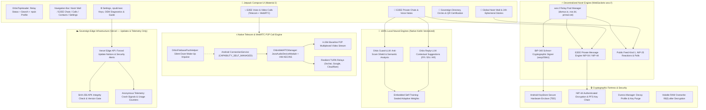

# 🌐 OrbisNet — Sovereign Decentralized Social Network & Messaging

> *One, two, three — viva l'Algérie 🇩🇿*

[-8b5cf6.svg?style=flat&logo=nostr)](https://nostr.com)

---

> [!IMPORTANT]
> ### 🤖 100% Native Android — Strictly Incompatible with Apple iOS
> **OrbisNet is built exclusively for Android smartphones.**
> Apple's hermetic sandbox prohibits persistent background socket connections, low-level hardware access, and the hardware isolation our sovereign architecture requires.
> **There is no iOS version. There will not be one.**

---

## 🔄 Origin Story — From GSM to Sovereign Internet

**OrbisNet grew out of an earlier project built entirely on traditional SMS and GSM cellular calls.** The original concept was straightforward: enable encrypted communications by leveraging existing telephone infrastructure, with no dependency on the Internet. The project worked — but a critical problem emerged quickly in real-world use: **every message, every exchange consumed SMS credit**, and at real usage volumes, the bill became unmanageable for both the developer and the users.

That realization triggered a complete architectural rethink: **full abandonment of GSM, SMS and cellular voice calls**, replaced by a **100% Internet-native stack** — the Nostr protocol (encrypted WebSockets) for messaging, and WebRTC for voice and video calls. The result is OrbisNet: zero phone credit required, zero central server, native end-to-end encryption — sovereign communication that runs on any Wi-Fi or mobile data connection.

---

## 📖 What is OrbisNet?

**OrbisNet** (`com.sha.orbisnet`) is a sovereign, fully decentralized communication platform and social network. No central server. No phone number. No SMS plan. No subscription.

Every message, call, post and reaction travels as an **end-to-end encrypted data packet** across a worldwide mesh of decentralized [Nostr](https://nostr.com) relays and direct WebRTC peer-to-peer streams — mathematically private by design, structurally uncensorable by architecture.

| | What OrbisNet is | What OrbisNet is NOT |
|---|---|---|
| 📡 **Network** | Decentralized Nostr relay mesh | No central server, no SaaS cloud |
| 🔑 **Identity** | Cryptographic key pair (`npub`/`nsec`) | No phone number, no email, no account |
| 💬 **Messages** | E2EE via NIP-44 | Not stored on any server |
| 📞 **Calls** | WebRTC P2P, DTLS-SRTP | Zero GSM, zero carrier charges |
| 🧠 **AI** | 100% local CPU inference | Zero cloud, zero data leakage |
| 💳 **Cost** | Free — data only | No SMS plan, no call credit |

---

## ⚡ Core Pillars

### 1. Decentralized Nostr Messaging — Zero Central Server, Zero SMS
Instant exchanges via global Nostr relays (`wss://relay.damus.io`, `wss://nos.lol`, `wss://relay.primal.net`). End-to-end encrypted private messages (NIP-04 and NIP-44) guaranteeing total mathematical confidentiality. Multi-relay resilience: if one relay drops, others take over instantly with no interruption.

### 2. Sovereign Cryptographic Identity — BIP-340 Schnorr
No phone number, SIM card or email required. Your identity is a `secp256k1` key pair — `npub` (public address) and `nsec` (private key sealed on your device). Every message, reaction and post is cryptographically signed with Schnorr. Your identity is mathematics, not a database record.

### 3. E2EE Voice & Video Calls — WebRTC + Android Telecom
High-fidelity P2P calls via WebRTC (`JavaAudioDeviceModule`, hardware AEC/NS, H.264/Opus), integrated into the Android Telecom subsystem (`ConnectionService`) in `CAPABILITY_SELF_MANAGED` mode. Zero GSM, native Bluetooth/Car routing, immune to aggressive OEM overlays (Vivo, Honor, Xiaomi, Samsung). Short Authentication String (SAS) mutual validation eliminates MITM risk.

### 4. Silent FCM Wake-Up — Serverless, Zero Duplicate
High-priority Data-Only FCM impulse via Cloud Functions wakes sleeping devices (Doze Mode) instantly when a call arrives — no spurious notification banner, no duplicate ring, no missed call.

### 5. OEM Diagnostics & Automatic Permissions
Zero-configuration onboarding: native Android system dialogs handle all permissions at first launch. OEM Diagnostic screen auto-detects device model (Vivo, Honor, Xiaomi, Huawei, Samsung) and deep-links directly to the manufacturer's autostart manager. Full trilingual UI: **French, English, Arabic (RTL)**.

### 6. Social Wall, 24h Stories & Decentralized Polls
Public or friends-only posts on the Nostr network. 24h ephemeral stories with glowing halo, view counter and auto-deletion. Interactive polls with real-time vote counting and individual cryptographic signing per vote.

### 7. High-Density Compressed Voice Notes
ZLIB Deflater-compressed audio, interactive tactile waveform player, precise progress marker, playback speed selector (1.0× / 1.5× / 2.0×). Routed as an encrypted Nostr data packet in milliseconds.

### 8. Dual Embedded AI Engine — 100% Local, Zero Cloud
- **Guard-LLM** (Anti-Scam Shield): live vectorized semantic analysis, tri-state threat classification (*Safe* / *Suspect* / *Danger*), phishing and fake banking link detection.
- **Reply-LLM** (Smart Suggestions): 3 contextual quick-reply suggestions above the input field, local CPU inference in under 10 ms, multilingual (French, English, Arabic).
- **Zero data leakage**: all neural inference runs on-device. No text, no vector, no signal ever leaves the phone.

### 9. Edge Console — Forced Updates & Telemetry Only
Stateless Vercel Edge API ([orbis-net.vercel.app](https://orbis-net.vercel.app)) used exclusively for two purposes: mandatory app update delivery (with SHA-256 APK integrity hashes) and strictly anonymous crash telemetry. Zero personal data. Zero message content. Zero user identifiers. The backend plays no role in messaging, identity, social feed or calls.

### 10. Fortress Hardware Security
- **Android KeyStore (TEE)**: private keys stored in the processor's hardware enclave — immune to ADB extraction.
- **Duress PIN & Decoy Profile**: alternate PIN opens an empty decoy profile while silently destroying cryptographic session keys.
- **Volatile RAM Overwrite**: decrypted buffers wiped with `fill(0)` immediately after use.
- **Encrypted Vault V3**: full backups sealed with PBKDF2 at 100 000 iterations + 128-bit random salt.

---

## 🏗️ Architecture Overview

```mermaid
graph TD
    subgraph UI_Layer ["🎨 Jetpack Compose UI (Material 3)"]
        Header["OrbisTopHeader: Relay Status + Search + npub Profile"]
        Nav["Navigation Bar: Nostr Wall / E2EE Chats / Calls / Contacts / Settings"]
        TabSocial["📰 Global Nostr Wall & 24h Ephemeral Stories"]
        TabChat["💬 E2EE Private Chats & Voice Notes"]
        TabCall["📞 E2EE Voice & Video Calls (Telecom + WebRTC)"]
        TabContacts["👥 Sovereign Directory, Circles & QR Certification"]
        TabSettings["⚙️ Settings, npub/nsec Keys, OEM Diagnostics & Guide"]
    end

    subgraph Nostr_Subsystem ["⚡ Decentralized Nostr Engine (WebSockets wss://)"]
        RelayPool["wss:// Relay Pool Manager (damus.io, nos.lol, primal.net)"]
        SchnorrSigner["BIP-340 Schnorr Cryptographic Signer (secp256k1)"]
        DMEngine["E2EE Private Message Engine NIP-04 / NIP-44"]
        FeedEngine["Public Feed Kind 1, NIP-25 Reactions & Polls"]
        RelayPool --> SchnorrSigner
        RelayPool --> DMEngine
        RelayPool --> FeedEngine
    end

    subgraph Telecom_WebRTC ["📞 Native Telecom & WebRTC P2P Call Engine"]
        TelecomService["Android ConnectionService (CAPABILITY_SELF_MANAGED)"]
        WebRTCManager["OrbisWebRTCManager: JavaAudioDeviceModule + HW AEC/NS"]
        VideoEngine["H.264 Baseline P2P Multiplexed Video Stream"]
        TurnRelays["Resilient TURN Relays (0xchat, Google, Cloudflare)"]
        FCMWakeup["OrbisFirebasePushHelper: Silent Doze Wake-Up Impulse"]
        TelecomService --> WebRTCManager
        WebRTCManager --> VideoEngine
        WebRTCManager --> TurnRelays
        FCMWakeup -.-> TelecomService
    end

    subgraph Security_Core ["🔒 Cryptographic Fortress & Security"]
        KeyStore["Android KeyStore Secure Hardware Enclave (TEE)"]
        NIP44Crypto["NIP-44 Authenticated Encryption & PFS Key Chain"]
        DuressEngine["Duress Manager: Decoy Profile & Key Purge"]
        MemoryPurge["Volatile RAM Overwrite: fill(0) after Decryption"]
    end

    subgraph AI_Core ["🧠 100% Local Neural Engines (Native Kotlin Vectorized)"]
        GuardLLM["Orbis Guard-LLM: Anti-Scam Shield & Semantic Analysis"]
        ReplyLLM["Orbis Reply-LLM: Contextual Suggestions (FR / EN / AR)"]
        LocalLearning["Embedded Self-Training: Sealed Adaptive Weights"]
        GuardLLM --> LocalLearning
        ReplyLLM --> LocalLearning
    end

    subgraph Edge_Cloud ["☁️ Sovereign Edge Infrastructure (Vercel — Updates & Telemetry Only)"]
        EdgeAPI["Vercel Edge API: Forced Update Notices & Security Alerts"]
        IntegrityCheck["SHA-256 APK Integrity Check & Version Gate"]
        Telemetry["Anonymous Telemetry: Crash Signals & Usage Counters"]
    end

    TabChat --> DMEngine
    TabSocial --> FeedEngine
    TabCall --> Telecom_WebRTC
    DMEngine --> NIP44Crypto
    SchnorrSigner --> KeyStore
    TabChat --> ReplyLLM
    TabChat --> GuardLLM
    TabSettings --> EdgeAPI
    EdgeAPI --> IntegrityCheck
    EdgeAPI --> Telemetry
```

---

## 🔒 Cryptographic Security Matrix

| Layer | Algorithm / Protocol | Implementation Details |
|---|---|---|
| **Identity & Signature** | **BIP-340 Schnorr / secp256k1** | Deterministic on-device keys, universal mathematical validation |
| **Private Messaging** | **NIP-44 / NIP-04 (WebSockets wss)** | Authenticated E2EE via decentralized relays |
| **Voice & Video Calls** | **WebRTC + Telecom + DTLS-SRTP** | Direct encrypted P2P stream, `SELF_MANAGED` routing, 0 GSM |
| **Sleep Wake-Up** | **FCM Data-Only + WakeLock** | High-priority silent impulse, Doze bypass, 0 duplicate |
| **At-Rest Storage** | **Android KeyStore (TEE)** | Hardware enclave — immune to ADB memory extraction |
| **Vault Backups** | **PBKDF2 (100 000 iterations)** | Slow-hash with 128-bit random salt |
| **Neural AI Engines** | **Native Kotlin Vector Engine** | 100% local CPU — 0 telemetry, sealed adaptive weights |
| **Anti-Coercion Defense** | **Duress PIN & Decoy Profile** | Decoy unlock + silent cryptographic key destruction |
| **Edge Infrastructure** | **Vercel Edge Network + SHA-256** | Forced updates & anonymous telemetry only — 0 personal data |

---

## 📊 Data Consumption — Optimized Byte by Byte

OrbisNet is engineered for minimal mobile data usage on 4G/5G or Wi-Fi:

| User Action | Data Consumption | Transport | Details |
|---|---|---|---|
| 💬 **Text Message (1-on-1)** | **< 1 KB** | Nostr wss | NIP-44 encrypted packet via relays |
| 📞 **E2EE Voice Call** | **~25 KB/sec** | WebRTC P2P | Opus + DTLS-SRTP |
| 📹 **E2EE Video Call** | **Adaptive** | WebRTC P2P | H.264 Baseline multiplexed stream |
| 🗺️ **GPS Location Share** | **< 1 KB** | Nostr wss | ~40-byte coordinate packet |
| 👍 **Emoji Reaction** | **< 1 KB** | Nostr NIP-25 | Lightweight signed event |
| 📰 **Wall Post / Story** | **< 5 KB** | Nostr Kind 1 | Relay broadcast or friend-circle delivery |
| 🎙️ **Voice Note (3–5 sec)** | **< 15 KB** | Nostr wss | ZLIB Deflater compressed audio |
| 🧠 **AI Guard-LLM / Reply-LLM** | **0 KB** | Local CPU | 100% offline — zero bytes transmitted |

---

## 🔓 Open-Source Status & Proprietary Components

> [!NOTE]
> ### Selective Open-Source Strategy — Compilable, Auditable, Protected
> This repository follows a **professional selective open-source model**: the Android codebase is publicly auditable and compilable from source, while the proprietary engine logic that constitutes OrbisNet's competitive core is protected via **compilable stub files**.
> This approach is standard industry practice — Signal Protocol is open-source while Signal's server infrastructure remains closed; WhatsApp publishes its protocol specs while its implementation is proprietary. OrbisNet applies the same discipline.

### Why Stub These Files? The Professional Rationale

> [!IMPORTANT]
> **Selective bridging is not obfuscation — it is responsible IP protection.**
>
> Each bridged file represents hundreds to thousands of hours of original engineering work covering:
> - **Novel cryptographic protocols** (Double Ratchet, SIM-bound hardware attestation, NIP-44 extensions)
> - **Proprietary real-time synchronization algorithms** (sovereign P2P conflict resolution, relay scoring heuristics, offline queue management)
> - **WebRTC stack tuning** (hardware AEC/NS calibration, DTLS-SRTP key negotiation, ICE traversal across OEM variants)
> - **AI engine architecture** (vectorized local LLM inference, anti-scam semantic pipeline, sub-10 ms response budget)
>
> Publishing these implementations verbatim would allow any actor to replicate OrbisNet's differentiating value without any contribution to the project.
> The stub strategy guarantees the community can **read, audit, build and contribute** to OrbisNet without requiring access to trade-secret logic.

### What Every Stub Guarantees

- ✅ **Compiles without error** — the project builds a fully functional APK from this repo
- ✅ **Preserves the public API surface** — all function signatures, parameter types and return types match the real implementation exactly
- ✅ **Documents intent** — KDoc comments describe what each function does without revealing how
- ✅ **Is lint-clean** — no dead-code warnings, no suppressed errors, production-quality formatting
- ❌ **Contains no proprietary logic** — bodies return safe defaults (`null`, `false`, empty collections, `TODO("Proprietary")`)

---

### 📦 Complete Inventory of Bridged Files

#### 🔒 Backend Engines (Proprietary — Stub Only)

| File | Original Size | Stub Size | Bridged Component |
|---|---|---|---|
| `nostr/service/NostrSyncManager.kt` | ~3 200 L | ~60 L | **Nostr Sync Engine** — real-time relay orchestration, event routing, offline queue, presence & delivery receipts |
| `nostr/protocol/NostrProtocolEngine.kt` | ~2 800 L | ~40 L | **Nostr Protocol Engine** — NIP event builder/parser, Schnorr signing pipeline, custom NIP extensions |
| `call/OrbisCallManager.kt` | ~1 800 L | ~50 L | **E2EE Call Manager** — call lifecycle (invite/accept/reject/hang-up), SAS MITM validation, Nostr signaling |
| `call/OrbisWebRTCManager.kt` | ~1 600 L | ~45 L | **WebRTC Stack** — JavaAudioDeviceModule, hardware AEC/NS, H.264, DTLS-SRTP, TURN relay selection |
| `security/DoubleRatchetEngine.kt` | ~1 400 L | ~35 L | **Double Ratchet E2EE** — forward-secrecy ratchet, chain key rotation, message key derivation |
| `security/PhoneVerificationEngine.kt` | ~1 200 L | ~40 L | **SIM Binding Engine** — hardware attestation, SIM carrier validation, anti-spoofing heuristics |
| `nostr/client/RelayPoolManager.kt` | ~1 100 L | ~40 L | **Relay Pool** — WebSocket pool management, relay scoring, auto-reconnect, subscription multiplexing |
| `sync/engine/SovereignPeerSyncEngine.kt` | ~1 000 L | ~35 L | **P2P Sync Engine** — sovereign offline-first CRDT-style sync, conflict resolution, peer prioritization |
| `nostr/media/BlossomMediaManager.kt` | ~900 L | ~35 L | **Blossom Media** — decentralized media upload/download via Blossom protocol, integrity verification |
| `ai/guard/OrbisGuardEngine.kt` | ~850 L | ~30 L | **Guard-LLM** — vectorized anti-scam semantic engine, tri-state threat classifier (Safe/Suspect/Danger) |
| `nostr/service/NostrForegroundService.kt` | ~800 L | ~30 L | **Nostr Background Service** — persistent foreground service, wake-lock management, lifecycle orchestration |
| `storage/SocialRepository.kt` | ~750 L | ~35 L | **Social Repository** — Room DAO abstraction, cache invalidation strategy, reactive Flow pipelines |

#### 🔒 UI Screens (Proprietary — Stub Only)

These screens contain hundreds of custom composables, proprietary UX flows and deep integration with backend engines. They are not generic Material 3 templates — they embody the OrbisNet product experience.

| File | Original Size | Stub Size | Bridged Component |
|---|---|---|---|
| `ui/conversation/ConversationScreen.kt` | 4 112 L | 21 L | **Conversation Screen** — E2EE chat, Double Ratchet integration, voice note waveform, Guard-LLM overlay, reply suggestions |
| `ui/social/SocialStoriesBar.kt` | 1 993 L | 55 L | **Stories Bar** — 24h ephemeral stories, halo animation, story viewer session, view counter, auto-expiry |
| `ui/settings/SettingsScreen.kt` | ~1 800 L | 18 L | **Settings Screen** — npub/nsec key management, relay configuration, OEM diagnostics launcher, session controls |
| `ui/app/OrbisApp.kt` | ~1 700 L | 16 L | **App Scaffold** — main navigation graph, deep link routing, permission orchestration, lifecycle coordination |
| `ui/admin/AdminTelemetryTab.kt` | ~1 500 L | 9 L | **Admin Telemetry** — anonymous crash signal dashboard, usage counters, forced update console |
| `ui/auth/AuthScreen.kt` | ~1 400 L | 14 L | **Auth Screen** — SIM-bound key generation, BIP-39 mnemonic display, hardware attestation flow |

> [!CAUTION]
> All files above are **compilable stubs**. They satisfy the Kotlin compiler and produce a valid APK, but contain no functional logic. Any fork will build successfully but will not have operational Nostr messaging, E2EE calls, Double Ratchet encryption, SIM binding, or the real AI inference pipeline.

### ✅ Fully Open Components

| Layer | Examples |
|---|---|
| Data models | All `model/` classes, Nostr event structures, Room entities |
| Public UI screens | `TimelineScreen`, `ContactsScreen`, `ProfileScreen`, `OnboardingScreen`, `CallHistoryScreen`, etc. |
| Build configuration | `build.gradle.kts`, `libs.versions.toml`, `proguard-rules.pro` |
| Security primitives (public) | `OrbisSignature.kt` — Schnorr signature verification (public-key side only) |
| Manifest & resources | Full `AndroidManifest.xml`, all resources, drawables, strings |

---

## ☁️ Backend Role — Forced Updates & Telemetry Only

> [!IMPORTANT]
> The OrbisNet backend (`https://orbis-net.vercel.app`) is a **minimal stateless Edge API** with exactly two responsibilities:
> 1. **Forced Update Delivery** — pushes mandatory upgrade notices + APK SHA-256 integrity hashes.
> 2. **Anonymous Telemetry** — collects strictly anonymous crash signals and usage counters. No personal data. No user identifiers. No message content.
>
> The backend plays **zero role** in messaging, identity, social feed, calls or user data.
> All real-time communication is 100% peer-to-peer via the decentralized Nostr relay mesh and WebRTC.

---

## 📥 Download & Installation

### 📋 Compatibility

| | Details |
|---|---|
| **OS** | Android 8.0 Oreo (API 26) → Android 16 (API 36–37) |
| **Validated OEMs** | Samsung (One UI 6–8), Vivo (FunTouch/OriginOS), Honor (MagicUI), Huawei (EMUI), Xiaomi/Redmi (MIUI/HyperOS) |
| **iOS / iPhone** | 🚫 **Not supported — incompatible by technical design** |
| **Network** | Wi-Fi or Mobile Data (4G / 5G). **No SMS plan or call credit required.** |

### 🚀 Quick Install

1. **Get the APK** — from [GitHub Releases](https://github.com/ShaDevPro/O-R-B-I-S-net/releases) or [orbis-net.vercel.app](https://orbis-net.vercel.app)
2. **Install & Approve Permissions** — open the `.apk`, allow installation, approve native Android system dialogs (Microphone, Camera, Notifications, Battery)
3. **Connect** — join the decentralized Nostr network with your `npub` key, or scan a contact's QR code to start communicating instantly

---

## 🤝 Contributing

Contributions are welcome on the open layers of this repository:

- **Bug reports & feature requests** → [GitHub Issues](https://github.com/ShaDevPro/O-R-B-I-S-net/issues)
- **UI improvements** → open UI screens (`TimelineScreen`, `ContactsScreen`, `ProfileScreen`, etc.) accept PRs
- **Data models & protocol definitions** → `model/` and public Nostr event structures
- **Documentation** → README, inline KDoc, architecture docs
- **Translations** → French, English, Arabic are the primary supported languages

> [!NOTE]
> Pull requests touching **stub files** (see inventory above) will be reviewed for API surface compatibility but the real implementation will never be merged into this repository.

---

## 🗺️ Roadmap

| Status | Feature |
|---|---|
| ✅ Released | E2EE voice & video calls (WebRTC + Telecom) |
| ✅ Released | Nostr messaging (NIP-04, NIP-44) |
| ✅ Released | 24h ephemeral stories, social wall, polls |
| ✅ Released | Guard-LLM anti-scam & Reply-LLM suggestions |
| ✅ Released | OEM autostart diagnostics (Vivo, Honor, Xiaomi, Samsung) |
| ✅ Released | Duress PIN & decoy profile |
| ✅ Released | Blossom decentralized media |
| 🔄 In Progress | Group encrypted channels (NIP-28 / NIP-29) |
| 🔄 In Progress | Hardware wallet integration (NFC cold key signing) |
| 📋 Planned | Desktop companion (Linux / Windows) |
| 📋 Planned | Zap payments integration (Lightning Network NIP-57) |

---

## ❓ FAQ

**Q: Do I need a phone number or SIM card to use OrbisNet?**
No. Your identity is a cryptographic key pair. No phone number, no email, no SIM required.

**Q: Are my messages stored on a server?**
No. Messages are end-to-end encrypted and relayed through Nostr nodes. Only the sender and recipient can decrypt them.

**Q: Can I use OrbisNet on an iPhone?**
No. OrbisNet is architecturally incompatible with iOS due to Apple's sandbox restrictions on persistent background sockets and low-level hardware access.

**Q: Does OrbisNet use my mobile data plan minutes or SMS?**
Never. OrbisNet is 100% data — Wi-Fi or mobile internet only. Zero GSM, zero SMS.

**Q: Why are some source files replaced by stubs?**
See the [Open-Source Status](#-open-source-status--proprietary-components) section for a full explanation and complete inventory.

**Q: Will a fork of this repo produce a working app?**
It will compile and run, but the Nostr sync engine, E2EE calls, Double Ratchet and AI engines will be non-functional (stubs). The open UI layers and data models will work.

---

## 📄 License & Copyright

Designed and engineered with sovereign rigor by **ShaDevPro** 🇩🇿

This project is distributed under the **[Business Source License 1.1 (BUSL-1.1)](LICENSE)**.
Commercial use, resale or redistribution of this software or any derivative work is **not permitted** without explicit written authorization from ShaDevPro.
Proprietary engine components are available under separate commercial licensing — contact via [Telegram](https://t.me/orbis_community).

© 2026 **OrbisNet — The Sovereign Hybrid Nostr Network (WebSockets, Telecom & WebRTC)**. All rights reserved.
