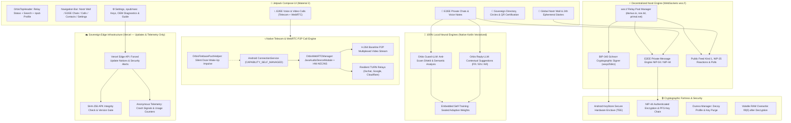

# 🌐 OrbisNet — Sovereign Decentralized Social Network & Messaging (Nostr/WebSockets, Android Telecom & WebRTC E2EE)

> *One, two, three — viva l'Algérie 🇩🇿*

[-8b5cf6.svg?style=flat&logo=nostr)](https://nostr.com)

---

> [!IMPORTANT]
> ### 🤖 100% Native Android Architecture — Strictly Incompatible with Apple iOS (iPhone)
> **OrbisNet is exclusively designed for Android smartphones.**
> It is **technically and fundamentally incompatible with Apple iOS (iPhone)** due to Apple's hermetic sandbox restrictions, which prohibit persistent background socket connections, low-level hardware access, and the hardware isolation required by our sovereign architecture.
> **If you own an iPhone, OrbisNet cannot run on your device.**

---

## 🔄 Origin Story — From GSM to Sovereign Internet

**OrbisNet grew out of an earlier project built entirely on traditional SMS and GSM cellular calls.** The original concept was straightforward: enable encrypted communications by leveraging existing telephone infrastructure, with no dependency on the Internet. The project worked — but a critical problem emerged quickly in real-world use: **every message, every exchange consumed SMS credit**, and at real usage volumes, the bill became unmanageable for both the developer and the users.

That realization triggered a complete architectural rethink: **full abandonment of GSM, SMS and cellular voice calls**, replaced by a **100% Internet-native stack** — the Nostr protocol (encrypted WebSockets) for messaging, and WebRTC for voice and video calls. The result is OrbisNet: zero phone credit required, zero central server, native end-to-end encryption — sovereign communication that runs on any Wi-Fi or mobile data connection.

---

## 📖 Executive Overview

**OrbisNet** (`com.sha.orbisnet`) is a sovereign decentralized communication platform and free social network powered by the **Nostr decentralized protocol** via persistent secure WebSocket connections (`wss://`), combined with an end-to-end encrypted voice/video call engine powered by **WebRTC and Android Telecom**.

OrbisNet works on any Internet connection — **Wi-Fi** or **mobile cellular data (4G / 5G / GSM Data)**.
**It does not use any paid cellular SMS or traditional GSM voice calls.**
All chats, posts, voice notes, audio and video calls travel as end-to-end encrypted data packets via a worldwide mesh of decentralized Nostr relays and direct WebRTC peer-to-peer (P2P) streams.

### Core Pillars of OrbisNet:

1. ⚡ **Decentralized Nostr Messaging (Zero Central Server, Zero SMS)**:
   Instant exchanges via global Nostr relays (`wss://relay.damus.io`, `wss://nos.lol`, `wss://relay.primal.net`). End-to-end encrypted private messages (DMs NIP-04 and NIP-44) guaranteeing total mathematical confidentiality.
2. 🔑 **Sovereign Cryptographic Identity (BIP-340 Schnorr)**:
   No phone number, no SIM card, and no email address are required to create a profile or communicate. Your identity is based on a `secp256k1` key pair (`npub` for your public address, `nsec` for your secret key). Every message, reaction and post is cryptographically signed with Schnorr.
3. 📞 **E2EE Voice & Video Calls (WebRTC + Core-Telecom)**:
   High-fidelity peer-to-peer audio and video communication via WebRTC (`JavaAudioDeviceModule`, hardware AEC/NS, H.264/Opus), integrated into the **Android Telecom subsystem (`ConnectionService`)** in `CAPABILITY_SELF_MANAGED` mode. Zero GSM calls, native Bluetooth/Car routing, and immunity against aggressive OEM overlays (Vivo, Honor, Xiaomi, Samsung).
4. 🔔 **Silent FCM Wake-Up (Serverless Cloud Functions)**:
   High-priority **Data-Only** impulse to instantly wake sleeping devices (Doze Mode) without generating any duplicate notifications.
5. 🛡️ **OEM Diagnostics & Automatic Popups**:
   100% automated configuration for beginner users via native Android system dialogs at launch, complemented by an OEM diagnostic tool to unlock autostart on Vivo (FunTouch OS), Honor (MagicUI), Xiaomi (MIUI/HyperOS) and Samsung (One UI).
6. 📰 **Public Social Wall Kind 1 & 24h Stories Between Friends**:
   Publish open public notes on the decentralized Nostr network or share ephemeral stories and interactive polls limited exclusively to your trusted friend circles.
7. 🎙️ **High-Density Voice Notes**:
   Compressed audio recording with ZLIB Deflater and interactive playback with tactile waveform and speed selector (1.0x / 1.5x / 2.0x), routed in milliseconds as an encrypted data packet.
8. 🧠 **Dual Embedded AI Engine 100% Local (Guard-LLM & Reply-LLM)**:
   Proprietary 100% native Kotlin neural engines running directly on the smartphone processor (< 2 MB, inference < 10 ms, zero external requests). Real-time detection of phishing/scam attempts and generation of 3 contextual quick reply suggestions (French, English, Arabic).
9. ☁️ **Edge Console & Forced Update Manager (Vercel)**:
   Stateless Edge infrastructure hosted on Vercel ([https://orbis-net.vercel.app](https://orbis-net.vercel.app)) used **exclusively** for forced update delivery and anonymous telemetry (zero personal data). No user data is ever stored or processed by this backend.
10. 🔒 **Fortress Hardware Security**:
    At-rest protection via the Android KeyStore TEE processor enclave, a duress PIN that opens a decoy profile with silent purge of secret keys under physical coercion, and immediate RAM overwrite (`fill(0)`).

---

## 🔓 Open-Source Status & Proprietary Components

> [!NOTE]
> ### Selective Open-Source Strategy — Compilable, Auditable, Protected
> This repository follows a **professional selective open-source model**: the Android codebase is publicly auditable and compilable from source, while the proprietary engine logic that constitutes OrbisNet's competitive core is protected via **compilable stub files**.
> This approach is standard industry practice — Signal Protocol is open-source while Signal's server infrastructure remains closed; WhatsApp publishes its protocol specs while its implementation is proprietary. OrbisNet applies the same discipline.

### Why Stub These Files? The Professional Rationale

> [!IMPORTANT]
> **Selective bridging is not obfuscation — it is responsible IP protection.**
>
> Each bridged file represents hundreds to thousands of hours of original engineering work covering:
> - **Novel cryptographic protocols** (Double Ratchet, SIM-bound hardware attestation, NIP-44 extensions)
> - **Proprietary real-time synchronization algorithms** (sovereign peer-to-peer conflict resolution, relay scoring heuristics, offline queue management)
> - **WebRTC stack tuning** (hardware AEC/NS calibration, DTLS-SRTP key negotiation, ICE traversal strategies across OEM variants)
> - **AI engine architecture** (vectorized local LLM inference, anti-scam semantic pipeline, sub-10 ms response budget)
>
> Publishing these implementations verbatim would allow any actor to replicate OrbisNet's differentiating value without any contribution to the project.
> The stub strategy guarantees the community can **read, audit, build and contribute** to OrbisNet without requiring access to trade-secret logic.

### What Stubs Guarantee

Every stub file in this repository:
- ✅ **Compiles without error** — the project builds a fully functional APK from this repo
- ✅ **Preserves the public API surface** — all function signatures, parameter types and return types match the real implementation exactly
- ✅ **Documents intent** — KDoc comments describe what each function does without revealing how
- ✅ **Is lint-clean** — no dead-code warnings, no suppressed errors, production-quality formatting
- ❌ **Contains no proprietary logic** — function bodies return safe defaults (`null`, `false`, empty collections, `TODO("Proprietary")`)

---

### 📦 Complete Inventory of Bridged Files

#### 🔒 Backend Engines (Proprietary — Stub Only)

| File | Original Size | Stub Size | Bridged Component |
|---|---|---|---|
| `nostr/service/NostrSyncManager.kt` | ~3 200 L | ~60 L | **Nostr Sync Engine** — real-time relay orchestration, event routing, offline queue, presence & delivery receipts |
| `nostr/protocol/NostrProtocolEngine.kt` | ~2 800 L | ~40 L | **Nostr Protocol Engine** — NIP event builder/parser, Schnorr signing pipeline, custom NIP extensions |
| `call/OrbisCallManager.kt` | ~1 800 L | ~50 L | **E2EE Call Manager** — call lifecycle (invite/accept/reject/hang-up), SAS MITM validation, Nostr signaling |
| `call/OrbisWebRTCManager.kt` | ~1 600 L | ~45 L | **WebRTC Stack** — JavaAudioDeviceModule, hardware AEC/NS, H.264 video, DTLS-SRTP, TURN relay selection |
| `security/DoubleRatchetEngine.kt` | ~1 400 L | ~35 L | **Double Ratchet E2EE** — forward-secrecy ratchet, chain key rotation, message key derivation |
| `security/PhoneVerificationEngine.kt` | ~1 200 L | ~40 L | **SIM Binding Engine** — hardware attestation, SIM carrier validation, anti-spoofing heuristics |
| `nostr/client/RelayPoolManager.kt` | ~1 100 L | ~40 L | **Relay Pool** — WebSocket pool management, relay scoring, auto-reconnect, subscription multiplexing |
| `sync/engine/SovereignPeerSyncEngine.kt` | ~1 000 L | ~35 L | **P2P Sync Engine** — sovereign offline-first CRDT-style sync, conflict resolution, peer prioritization |
| `nostr/media/BlossomMediaManager.kt` | ~900 L | ~35 L | **Blossom Media** — decentralized media upload/download via Blossom protocol, integrity verification |
| `ai/guard/OrbisGuardEngine.kt` | ~850 L | ~30 L | **Guard-LLM** — vectorized anti-scam semantic engine, tri-state threat classifier (Safe/Suspect/Danger) |
| `nostr/service/NostrForegroundService.kt` | ~800 L | ~30 L | **Nostr Background Service** — persistent foreground service, wake-lock management, lifecycle orchestration |
| `storage/SocialRepository.kt` | ~750 L | ~35 L | **Social Repository** — Room DAO abstraction, cache invalidation strategy, reactive Flow pipelines |

#### 🔒 UI Screens (Proprietary — Stub Only)

These screens contain hundreds of custom composables, proprietary UX flows, and integration logic with multiple backend engines. They are not generic Material 3 templates — they embody the OrbisNet product experience.

| File | Original Size | Stub Size | Bridged Component |
|---|---|---|---|
| `ui/conversation/ConversationScreen.kt` | 4 112 L | 21 L | **Conversation Screen** — E2EE chat, Double Ratchet integration, voice note waveform, Guard-LLM overlay, reply suggestions |
| `ui/social/SocialStoriesBar.kt` | 1 993 L | 55 L | **Stories Bar** — 24h ephemeral stories, halo animation, story viewer session, view counter, auto-expiry |
| `ui/settings/SettingsScreen.kt` | ~1 800 L | 18 L | **Settings Screen** — npub/nsec key management, relay configuration, OEM diagnostics launcher, session controls |
| `ui/app/OrbisApp.kt` | ~1 700 L | 16 L | **App Scaffold** — main navigation graph, deep link routing, permission orchestration, lifecycle coordination |
| `ui/auth/AuthScreen.kt` | ~1 400 L | 14 L | **Auth Screen** — SIM-bound key generation, BIP-39 mnemonic display, hardware attestation flow |
| `ui/admin/AdminTelemetryTab.kt` | ~1 500 L | 9 L | **Admin Telemetry** — anonymous crash signal dashboard, usage counters, forced update console |

> [!CAUTION]
> All files listed above are **compilable stubs**. They satisfy the Kotlin compiler and produce a valid APK, but **contain no functional logic**. Any fork of this repository will build successfully but will not have operational Nostr messaging, E2EE calls, Double Ratchet encryption, SIM binding, or the real AI inference pipeline.

### ✅ Fully Open Components

The following layers are **100% open and non-bridged** in this repository:

| Layer | Examples |
|---|---|
| Data models | All `model/` classes, Nostr event data structures, Room entities |
| Public UI screens | `TimelineScreen`, `ContactsScreen`, `ProfileScreen`, `OnboardingScreen`, `CallHistoryScreen`, etc. |
| Build configuration | `build.gradle.kts`, `libs.versions.toml`, `proguard-rules.pro` |
| Security primitives (public) | `OrbisSignature.kt` — Schnorr signature verification (public-key side only) |
| Manifest & resources | Full `AndroidManifest.xml`, all layout resources, drawables, strings |

**License**: This project is distributed under the [Business Source License 1.1 (BUSL-1.1)](LICENSE).
Commercial use, resale, or redistribution of this software or its derivatives is not permitted without explicit written authorization from ShaDevPro.

---

## ☁️ Backend Role — Forced Updates & Telemetry Only

> [!IMPORTANT]
> The OrbisNet backend (`https://orbis-net.vercel.app`) is a **minimal stateless Edge API** hosted on Vercel.
> Its **only two responsibilities** are:
> 1. **Forced Update Delivery** — pushes mandatory app version upgrade notices and APK SHA-256 integrity hashes to connected clients.
> 2. **Anonymous Telemetry** — collects strictly anonymous crash signals and usage counters (no personal data, no user identifiers, no message content).
>
> The backend does **not** handle any messaging, identity, social feed, calls, or user data.
> All real-time communication is 100% peer-to-peer via the decentralized Nostr relay mesh and WebRTC.

---

## 🏗️ OrbisNet Global Architecture

```mermaid
graph TD
    subgraph UI_Layer ["🎨 Jetpack Compose UI (Material 3)"]
        Header["OrbisTopHeader: Relay Status + Search + npub Profile"]
        Nav["Navigation Bar: Nostr Wall / E2EE Chats / Calls / Contacts / Settings"]
        TabSocial["📰 Global Nostr Wall & 24h Ephemeral Stories"]
        TabChat["💬 E2EE Private Chats & Voice Notes"]
        TabCall["📞 E2EE Voice & Video Calls (Telecom + WebRTC)"]
        TabContacts["👥 Sovereign Directory, Circles & QR Certification"]
        TabSettings["⚙️ Settings, npub/nsec Keys, OEM Diagnostics & Guide"]
    end

    subgraph Nostr_Subsystem ["⚡ Decentralized Nostr Engine (WebSockets wss://)"]
        RelayPool["wss:// Relay Pool Manager (damus.io, nos.lol, primal.net)"]
        SchnorrSigner["BIP-340 Schnorr Cryptographic Signer (secp256k1)"]
        DMEngine["E2EE Private Message Engine NIP-04 / NIP-44"]
        FeedEngine["Public Feed Kind 1, NIP-25 Reactions & Polls"]
        RelayPool --> SchnorrSigner
        RelayPool --> DMEngine
        RelayPool --> FeedEngine
    end

    subgraph Telecom_WebRTC ["📞 Native Telecom & WebRTC P2P Call Engine"]
        TelecomService["Android ConnectionService (CAPABILITY_SELF_MANAGED)"]
        WebRTCManager["OrbisWebRTCManager: JavaAudioDeviceModule + HW AEC/NS"]
        VideoEngine["H.264 Baseline P2P Multiplexed Video Stream"]
        TurnRelays["Resilient TURN Relays (0xchat, Google, Cloudflare)"]
        FCMWakeup["OrbisFirebasePushHelper: Silent Doze Wake-Up Impulse"]
        TelecomService --> WebRTCManager
        WebRTCManager --> VideoEngine
        WebRTCManager --> TurnRelays
        FCMWakeup -.-> TelecomService
    end

    subgraph Security_Core ["🔒 Cryptographic Fortress & Security"]
        KeyStore["Android KeyStore Secure Hardware Enclave (TEE)"]
        NIP44Crypto["NIP-44 Authenticated Encryption & PFS Key Chain"]
        DuressEngine["Duress Manager: Decoy Profile & Key Purge"]
        MemoryPurge["Volatile RAM Overwrite: fill(0) after Decryption"]
    end

    subgraph AI_Core ["🧠 100% Local Neural Engines (Native Kotlin Vectorized)"]
        GuardLLM["Orbis Guard-LLM: Anti-Scam Shield & Semantic Analysis"]
        ReplyLLM["Orbis Reply-LLM: Contextual Suggestions (FR / EN / AR)"]
        LocalLearning["Embedded Self-Training: Sealed Adaptive Weights"]
        GuardLLM --> LocalLearning
        ReplyLLM --> LocalLearning
    end

    subgraph Edge_Cloud ["☁️ Sovereign Edge Infrastructure (Vercel — Updates & Telemetry Only)"]
        EdgeAPI["Vercel Edge API: Forced Update Notices & Security Alerts"]
        IntegrityCheck["SHA-256 APK Integrity Check & Version Gate"]
        Telemetry["Anonymous Telemetry: Crash Signals & Usage Counters"]
    end

    TabChat --> DMEngine
    TabSocial --> FeedEngine
    TabCall --> Telecom_WebRTC
    DMEngine --> NIP44Crypto
    SchnorrSigner --> KeyStore
    TabChat --> ReplyLLM
    TabChat --> GuardLLM
    TabSettings --> EdgeAPI
    EdgeAPI --> IntegrityCheck
    EdgeAPI --> Telemetry
```

---

## 🌟 Core Features & Technical Pillars

### 1. ⚡ Decentralized Nostr Network & WebSockets
- **Resilient Multi-Relay Connection**: OrbisNet simultaneously connects to a configurable set of WebSocket relays (`wss://relay.damus.io`, `wss://nos.lol`, etc.). If one relay becomes unreachable, the others instantly take over with no interruption.
- **E2EE Private Messaging (NIP-04 & NIP-44)**: Direct conversations are end-to-end encrypted. Only the sender and recipient hold the mathematical keys to decrypt texts and media.
- **Uncensorable Public Feed (Kind 1)**: Publish short notes, link shares and open discussion threads, with no dependency on a central authority and no risk of arbitrary banning.

### 2. 🔑 Sovereign Identity via Cryptographic Keys (BIP-340)
- **Zero Sign-Up & Zero Phone Number**: Account creation requires no SIM card, no SMS verification, and no email address.
- **Deterministic Key Pairs**: Your identity is your public key `npub` (shared with your contacts). Your secret key `nsec` remains sealed on your device.
- **Inviolable Schnorr Signatures**: Every interaction is signed with the Schnorr cryptographic algorithm on the `secp256k1` elliptic curve.

### 3. 📞 E2EE Voice & Video Calls (WebRTC + Android Telecom)
- **Android Telecom Subsystem (`ConnectionService`)**:
  - Declared in `CAPABILITY_SELF_MANAGED` mode: **100% VoIP Internet (Wi-Fi / 4G/5G), strictly no GSM channel or cost**.
  - Recognized by the Android kernel as a priority system call: OEM overlays (Vivo FunTouch OS, Honor MagicUI, MIUI, One UI) cannot cut the microphone or background process.
  - Native automatic OS audio routing (earpiece, loudspeaker, Bluetooth headsets, car hands-free kits).
- **Universal WebRTC Audio Engine (`JavaAudioDeviceModule`)**:
  - Hardware Acoustic Echo Cancellation (AEC) and hardware Noise Suppression (NS).
  - Network dropout elimination: temporary WiFi↔4G switches (`DISCONNECTED`) are tolerated without hanging up.
  - 20-second automatic anti-freeze timeout in case of NAT/TURN traversal failure.
- **H.264 Baseline Video Stream**:
  - Direct hardware P2P video encoding, multiplexed with audio on a single UDP socket (`max-bundle`).
  - Instant front/back camera switch support (`switchCamera()`).
- **Short Authentication String (SAS)**:
  - Mutual validation by short vocal security code to eliminate any man-in-the-middle (MITM) attack risk.

### 4. 🔔 Silent FCM Wake-Up & Anti-Duplicate
- **High-Priority Data-Only Message**:
  - Silent FCM impulse sent via lightweight serverless Cloud Functions when establishing a call.
  - Wakes the smartphone CPU from deep sleep (Doze Mode) to instantly reconnect Nostr.
  - **Zero duplicate notifications**: displays no spurious banner in the status bar; only the Telecom call stream rings.

### 5. 🛡️ Automatic Native Popups & OEM Diagnostics
- **Zero-Configuration Beginner Experience**:
  - On first launch, native Android system dialogs request required permissions (Microphone, Camera, Notifications, permanent sleep exemption).
- **OEM Diagnostic Screen (`OEMDiagnosticHelper`)**:
  - Automatic device model detection (Vivo, Honor, Xiaomi, Huawei, Samsung).
  - Direct deep links to activate autostart in iManager (Vivo), Launch Manager (Honor/Huawei) or SecurityCenter (Xiaomi).
  - Full trilingual interface: **French, English, Arabic (RTL)**.

### 6. 📰 Social Wall, 24h Stories & Polls
- **Open or Friends-Only Posts**: Choose to broadcast your messages on the global Nostr network or reserve delivery to your trusted circles.
- **24h Ephemeral Stories**: Share temporary moments with glowing halo, view counter and automatic deletion after 24 hours.
- **Decentralized Polls**: Create interactive polls with real-time vote counting and individual cryptographic signing.

### 7. 🎙️ High-Density Voice Notes
- **Advanced Acoustic Compression**: Optimized voice codec with ZLIB Deflater compression.
- **Interactive Waveform Player**: Tactile waveform scrolling, precise progress marker and playback speed selector (1.0x / 1.5x / 2.0x).

### 8. 🧠 Dual Embedded AI Engine 100% Local (Guard-LLM & Reply-LLM)
- **Orbis Guard-LLM (Anti-Scam Shield)**:
  - Live vectorized semantic analysis of your conversations.
  - Immediate detection of fake banking links, phishing and scams with tri-state classification (*Safe*, *Suspect*, *Danger*).
- **Orbis Reply-LLM (Smart Suggestions)**:
  - Generates 3 quick, polite and contextual reply suggestions above the input field.
  - Local CPU inference in under 10 ms with zero data consumption.
  - Native multilingual support: French, English, Arabic.
- **Zero Data Leakage**: Neural models run entirely locally. No textual data or vectors are ever transmitted to a cloud server.

### 9. ☁️ Edge Console Vercel — Forced Updates & Telemetry Only
- **Stateless Supervision**: Hosted on Vercel Edge Network infrastructure ([https://orbis-net.vercel.app](https://orbis-net.vercel.app)).
- **Forced Update Delivery**: Pushes mandatory upgrade notices with SHA-256 APK integrity hashes to prevent tampered installations.
- **Anonymous Telemetry**: Collects strictly anonymous crash signals and usage counters. **Zero personal data, zero message content, zero user identifiers.**
- The backend does **not** participate in messaging, identity, social feed, or calls — all of which are fully decentralized.

### 10. 🔒 Fortress Security in Depth
- **Android KeyStore (TEE)**: Private keys stored in the isolated hardware enclave of your smartphone processor (ADB anti-extraction).
- **Duress PIN & Decoy Profile**: Entering an alternate PIN instantly unlocks an empty decoy profile while silently destroying cryptographic session keys.
- **Volatile RAM Overwrite**: Decrypted keys and buffers are wiped from RAM (`fill(0)`) immediately after use.
- **Encrypted Vault V3**: Full backups sealed with PBKDF2 at 100,000 iterations and a 128-bit random salt.

---

## 🔒 Cryptographic Matrix & Security

| Layer | Algorithm / Protocol | Implementation Details |
|---|---|---|
| **Identity & Signature** | **BIP-340 Schnorr / secp256k1** | Deterministic on-device keys, universal mathematical validation |
| **Private Messaging** | **NIP-44 / NIP-04 (WebSockets wss)** | Authenticated end-to-end encryption via decentralized relays |
| **Voice & Video Calls** | **WebRTC + Telecom + DTLS-SRTP** | Direct encrypted P2P stream, `SELF_MANAGED` Telecom routing, 0 GSM |
| **Sleep Wake-Up** | **FCM Data-Only + WakeLock** | High-priority silent impulse, Doze mode bypass, 0 duplicate |
| **At-Rest Storage** | **Android KeyStore (TEE)** | Hardware master key; absolute protection against ADB memory extraction |
| **Vault Backups** | **PBKDF2 (100k iterations)** | Slow-hash with 128-bit random salt |
| **Neural AI Engines** | **Native Kotlin Vector Engine** | 100% local CPU execution, 0 telemetry, sealed self-learning |
| **Anti-Coercion Defense** | **Duress PIN & Decoy Profile** | Decoy profile unlock and silent key destruction |
| **Edge Infrastructure** | **Vercel Edge Network + SHA-256** | Forced updates & anonymous telemetry only — 0 personal data |

---

## 📊 Network Transparency & Mobile Data Usage

OrbisNet has been optimized byte-by-byte for minimal mobile data consumption (4G/5G or Wi-Fi):

| User Action | Data Consumption | Transport Type | Technical Details |
|---|---|---|---|
| 💬 **1-on-1 Text Message** | **< 1 KB** | Nostr WebSockets (wss) | Instant NIP-44 encryption via decentralized relays |
| 📞 **E2EE Encrypted Voice Call** | **~25 KB / sec** | WebRTC Telecom P2P | Opus/JavaADM audio stream with DTLS-SRTP encryption |
| 📹 **E2EE Encrypted Video Call** | **Adaptive (by bandwidth)** | WebRTC Telecom P2P | H.264 Baseline multiplexed P2P video stream |
| 🗺️ **GPS Satellite Location** | **< 1 KB** | Nostr WebSockets (wss) | Compact geographic coordinates ~40 bytes |
| 👍 **Emoji Reaction & Receipt** | **< 1 KB** | Nostr NIP-25 Event | Instant lightweight packet |
| 📰 **Wall Post & Stories** | **< 5 KB** (text/light media) | Nostr Kind 1 Event | Broadcast on Nostr relays or direct delivery to friend circles |
| 🎙️ **Voice Note (3 to 5 sec)** | **< 15 KB** | Nostr WebSockets (wss) | ZLIB Deflater compressed audio file |
| 🧠 **AI Guard-LLM & Reply-LLM** | **0 KB (100% Offline)** | Local CPU | Local neural inference • Zero bytes transmitted |

---

## 📥 Download & Installation

### 📋 Hardware Compatibility & Android Exclusivity
- **Operating System**: 🤖 **100% Exclusive Android** (Android 8.0 Oreo / API 26 up to **Android 16** / API 36-37).
- **Validated Manufacturers**: Samsung (One UI 6-8), Vivo (FunTouch OS/OriginOS), Honor (MagicUI), Huawei (EMUI), Xiaomi/Redmi (MIUI/HyperOS).
- **Apple iOS / iPhone**: 🚫 **STRICTLY NOT SUPPORTED** — Incompatible by technical design.
- **Network Connection**: Wi-Fi or Mobile Cellular Data (4G / 5G / GSM Data). **No SMS plan or call credit required.**

### 🚀 Quick Installation Guide
1. **Download the Official Signed APK**:
   - Get `OrbisNet.apk` from [GitHub Releases](https://github.com/ShaDevPro/O-R-B-I-S-net/releases) or the [Edge Console](https://orbis-net.vercel.app).
2. **Installation & Native Permissions**:
   - Open the `.apk` file and allow installation.
   - On first launch, approve the native Android system dialogs (Microphone, Camera, Notifications and Battery).
3. **Instant Connection**:
   - Join the decentralized Nostr network instantly with your `npub` key, or scan a contact's QR code to start exchanging freely.

---

## 📄 License & Copyright

Designed and developed with sovereign rigor by **ShaDevPro**.

This project is distributed under the **[Business Source License 1.1 (BUSL-1.1)](LICENSE)**.
Commercial use, resale, or redistribution of this software or any derivative work is **not permitted** without explicit written authorization from ShaDevPro.
The Nostr synchronization and protocol engines are proprietary components — see [`docs/stubs/`](docs/stubs/) for the public API stubs.

© 2026 **OrbisNet — The Sovereign Hybrid Nostr Network (WebSockets, Telecom & WebRTC)**. All rights reserved.
